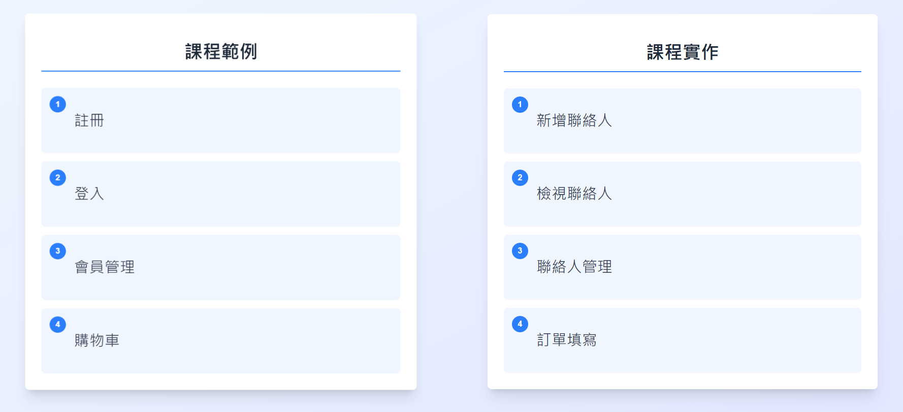
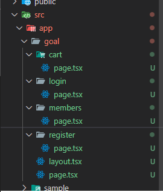

### **課程目標**

接下來的課程將會開始帶大家完成一個 簡單的網站
主要分成課程範例、課程實作

可參考 [https://project10543024.hlddian.com/goal](https://project10543024.hlddian.com/goal)

檔案結構如下

#### 課程範例

1. **註冊** 功能使用前次課程中的範例 加入導航列
2. **登入** 功能使用上次作業 加入導航列
3. **會員管理** 將使用DataTable 進行實作
4. **購物車** 使用本週課程 第一章節內容 套用

#### 課程實作

請各位同學在這次課程中 完成以下功能

參考 [Goal.md](../../Goal.md)

1. **新增聯絡人**
2. **檢視聯絡人**
3. **聯絡人管理**
4. **訂單填寫**

## 聯絡人管理系統

新增聯絡人

- 姓名
- 電話
- 電子郵件
- 備註

---

## 檢視聯絡人

- 查詢框
- 查詢後顯示查詢結果
- 包含以下資訊
  - 姓名
  - 電話
  - 電子郵件
  - 備註

---

## 聯絡人管理

可列出所有聯絡人，包含以下資訊：

- 姓名
- 電話
- 電子郵件
- 備註

---

## 訂單管理

### 訂單填寫

包含以下欄位：

- 品名
- 數量
- 單價
- 小計
- 總計

### 訂單明細

- 送出訂單後顯示訂單明細
