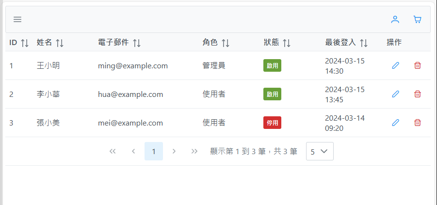
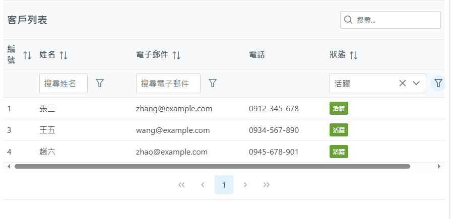

# 📊 第四週：資料處理與動態渲染

Week 4: Data Processing and Dynamic Rendering

## 📚 課程概述 Course Overview

本週將深入探討 React 中的資料處理與動態渲染技巧。我們將學習如何設計和處理資料結構，使用 PrimeReact 的 DataTable 元件來展示和操作資料，並學習如何與 Web API 進行互動。通過實作實際案例，我們將掌握資料的獲取、處理和展示的完整流程。

This week we will explore data processing and dynamic rendering techniques in React. We'll learn how to design and process data structures, use PrimeReact's DataTable component to display and manipulate data, and learn how to interact with Web APIs. Through practical implementation, we'll master the complete process of data acquisition, processing, and presentation.

## 📑 章節 Chapters

1. 📊 資料結構設計與處理、列表渲染與排序
   Data Structure Design and Processing 、List Rendering and Sorting
2. 🔄
3. 🌐 認識 Web API
   Understanding Web API
4. 📡 呼叫 Web API 並將資料結構化呈現
   Calling Web API and Structured Data Presentation

## 📝 課程內容 Course Content

### 1. 📊 使用者清單-資料結構設計與處理

User List - Data Structure Design and Processing

讓我們透過實作一個使用者清單來學習資料結構設計與 DataTable 的使用。

Let's learn data structure design and DataTable usage by implementing a user list.

[https://primereact.org/datatable/](https://primereact.org/datatable/)



- 在 DataTable 元件中

  1. 用 value 屬性渲染資料
  2. 用 paginator 屬性實作分頁功能
  3. 用 rows 屬性實作預設每頁顯示的資料數量 每頁顯示5筆 就設定 rows={5}
  4. 用 rowsPerPageOptions 屬性實作每頁顯示的資料數量選項 可以選擇每頁顯示5筆、10筆、25筆、50筆 就設定 rowsPerPageOptions={[5, 10, 25, 50]}
  5. 用 paginatorTemplate 屬性實作分頁模板 可以選擇要顯示的模板 預設是 FirstPageLink(第一頁)、PrevPageLink(上一頁)、PageLinks(頁碼)、NextPageLink(下一頁)、LastPageLink(最後一頁)、CurrentPageReport(目前頁數)、RowsPerPageDropdown(每頁顯示數量)
  6. 用 currentPageReportTemplate 屬性實作分頁資訊模板 可以選擇要顯示的模板 預設是 顯示第 {first} 到 {last} 筆，共 {totalRecords} 筆
  7. 用 className 屬性實作樣式 可以選擇要顯示的樣式 例如 p-datatable-sm(小)、p-datatable-md(中)、p-datatable-lg(大)
- 在 Column 元件中

  1. 用 field 屬性設定要顯示的資料欄位
  2. 用 header 屬性設定要顯示的表頭文字
  3. 用 sortable 屬性啟用排序功能
  4. 用 style 屬性設定要顯示的樣式 例如 width(寬度)、textAlign(文字對齊)、fontSize(字體大小)

```tsx
"use client";
import { useState } from "react";
import { DataTable } from "primereact/datatable";
import { Column } from "primereact/column";
import { Button } from "primereact/button";
import { Tag } from "primereact/tag";

interface User {
  id: number;
  name: string;
  email: string;
  role: string;
  status: "active" | "inactive";
  lastLogin: string;
}

export default function UserList() {
  // 使用者資料
  const [users] = useState<User[]>([
    {
      id: 1,
      name: "王小明",
      email: "ming@example.com",
      role: "管理員",
      status: "active",
      lastLogin: "2024-03-15 14:30",
    },
    {
      id: 2,
      name: "李小華",
      email: "hua@example.com",
      role: "使用者",
      status: "active",
      lastLogin: "2024-03-15 13:45",
    },
    {
      id: 3,
      name: "張小美",
      email: "mei@example.com",
      role: "使用者",
      status: "inactive",
      lastLogin: "2024-03-14 09:20",
    },
  ]);

  // 狀態標籤模板
  const statusTemplate = (rowData: User) => {
    // 用於顯示狀態的小圖標
    return (
      <Tag
        value={rowData.status === "active" ? "啟用" : "停用"}
        severity={rowData.status === "active" ? "success" : "danger"}
      />
    );
  };

  // 操作按鈕模板
  const actionTemplate = (rowData: User) => {
    return (
      <div className="flex gap-2">
        <Button
          icon="pi pi-pencil"
          className="p-button-rounded p-button-text p-button-sm"
          tooltip="編輯"
          onClick={() => alert(`編輯 ${rowData.name}`)}
        />
        <Button
          icon="pi pi-trash"
          className="p-button-rounded p-button-text p-button-danger p-button-sm"
          tooltip="刪除"
          onClick={() => alert(`刪除 ${rowData.name}`)}
        />
      </div>
    );
  };

  return (
    <div className="card">
      <DataTable
        value={users}
        paginator
        rows={5}
        rowsPerPageOptions={[5, 10, 25, 50]}
        paginatorTemplate="FirstPageLink PrevPageLink PageLinks NextPageLink LastPageLink CurrentPageReport RowsPerPageDropdown"
        currentPageReportTemplate="顯示第 {first} 到 {last} 筆，共 {totalRecords} 筆"
        className="p-datatable-sm"
      >
        <Column
          field="id" // 用於顯示資料的欄位
          header="ID" // 用於顯示表頭的文字
          sortable // 用於啟用排序功能
          style={{ width: "5%" }} // 用於設定欄位的寬度
        ></Column>
        <Column
          field="name"
          header="姓名"
          sortable
          style={{ width: "15%" }}
        ></Column>
        <Column
          field="email"
          header="電子郵件"
          sortable
          style={{ width: "25%" }}
        ></Column>
        <Column
          field="role"
          header="角色"
          sortable
          style={{ width: "15%" }}
        ></Column>
        <Column
          field="status"
          header="狀態"
          body={statusTemplate}
          sortable
          style={{ width: "15%" }}
        ></Column>
        <Column
          field="lastLogin"
          header="最後登入"
          sortable
          style={{ width: "15%" }}
        ></Column>
        <Column
          body={actionTemplate}
          header="操作"
          style={{ width: "10%" }}
        ></Column>
      </DataTable>
    </div>
  );
}

```

這個範例展示了：

1. **資料結構設計**

   - 使用 TypeScript 介面定義使用者資料結構
   - 明確的型別定義確保資料完整性
2. **DataTable 功能**

   - 分頁功能
   - 排序功能
   - 自訂模板渲染
   - 操作按鈕
3. **UI 元件整合**

   - 使用 PrimeReact 的 Tag 元件顯示狀態
   - 使用 Button 元件實作操作功能
4. **使用者體驗優化**

   - 工具提示（Tooltip）
   - 分頁資訊顯示
   - 欄位寬度控制

### 2. 🌐 認識 Web API

Understanding Web API

#### **API 基本概念 Basic API Concepts**

Web API 是應用程式之間進行資料交換的介面。讓我們了解基本的 API 概念。

Web API is an interface for data exchange between applications. Let's understand the basic API concepts.

```
get http://api.hlddian.com/recatclass/getUsers
get http://api.hlddian.com/recatclass/getUser?id=xxx
post http://api.hlddian.com/recatclass/updateUser	{User}
post http://api.hlddian.com/recatclass/insertUser	{User}
post http://api.hlddian.com/recatclass/deleteUser?id=xxx
```

```tsx
"use client";
import { useState, useEffect } from "react";
import { DataTable } from "primereact/datatable";
import { Column } from "primereact/column";
import { ProgressSpinner } from "primereact/progressspinner";

interface Post {
    id: number;
    title: string;
    body: string;
    userId: number;
}

export default function PostList() {
    const [posts, setPosts] = useState<Post[]>([]);
    const [loading, setLoading] = useState(true);

    useEffect(() => {
        // 模擬 API 呼叫
        const fetchPosts = async () => {
            try {
                const response = await fetch('https://jsonplaceholder.typicode.com/posts');
                const data = await response.json();
                setPosts(data);
            } catch (error) {
                console.error('Error fetching posts:', error);
            } finally {
                setLoading(false);
            }
        };

        fetchPosts();
    }, []);

    if (loading) {
        return (
            <div className="flex justify-center items-center h-screen">
                <ProgressSpinner />
            </div>
        );
    }

    return (
        <div className="card">
            <DataTable value={posts} paginator rows={10} className="p-datatable-sm">
                <Column field="id" header="ID" sortable></Column>
                <Column field="title" header="標題" sortable></Column>
                <Column field="body" header="內容"></Column>
                <Column field="userId" header="用戶ID" sortable></Column>
            </DataTable>
        </div>
    );
}
```

### 3. 📡 呼叫 Web API 並將資料結構化呈現

Calling Web API and Structured Data Presentation

#### **整合 API 與資料展示 Integrating API with Data Display**

讓我們實作一個完整的資料獲取和展示流程。

Let's implement a complete data fetching and display process.

```tsx
"use client";
import { useState, useEffect } from "react";
import { DataTable } from "primereact/datatable";
import { Column } from "primereact/column";
import { Button } from "primereact/button";
import { Toast } from "primereact/toast";
import { useRef } from "react";

interface Todo {
    id: number;
    title: string;
    completed: boolean;
}

export default function TodoList() {
    const [todos, setTodos] = useState<Todo[]>([]);
    const [loading, setLoading] = useState(true);
    const toast = useRef<Toast>(null);

    useEffect(() => {
        fetchTodos();
    }, []);

    const fetchTodos = async () => {
        try {
            const response = await fetch('https://jsonplaceholder.typicode.com/todos');
            const data = await response.json();
            setTodos(data);
        } catch (error) {
            showError('獲取資料失敗');
        } finally {
            setLoading(false);
        }
    };

    const showError = (message: string) => {
        toast.current?.show({
            severity: 'error',
            summary: '錯誤',
            detail: message,
            life: 3000
        });
    };

    const statusTemplate = (rowData: Todo) => {
        return (
            <span className={`px-2 py-1 rounded-full text-sm ${
                rowData.completed ? 'bg-green-100 text-green-800' : 'bg-yellow-100 text-yellow-800'
            }`}>
                {rowData.completed ? '已完成' : '未完成'}
            </span>
        );
    };

    const actionTemplate = (rowData: Todo) => {
        return (
            <div className="flex gap-2">
                <Button
                    icon="pi pi-check"
                    className="p-button-success p-button-sm"
                    tooltip="標記為完成"
                    tooltipOptions={{ position: 'top' }}
                    onClick={() => handleStatusChange(rowData)}
                />
                <Button
                    icon="pi pi-trash"
                    className="p-button-danger p-button-sm"
                    tooltip="刪除"
                    tooltipOptions={{ position: 'top' }}
                    onClick={() => handleDelete(rowData)}
                />
            </div>
        );
    };

    const handleStatusChange = (todo: Todo) => {
        setTodos(todos.map(item =>
            item.id === todo.id ? { ...item, completed: !item.completed } : item
        ));
    };

    const handleDelete = (todo: Todo) => {
        setTodos(todos.filter(item => item.id !== todo.id));
    };

    return (
        <div className="card">
            <Toast ref={toast} />
            <DataTable
                value={todos}
                paginator
                rows={10}
                loading={loading}
                className="p-datatable-sm"
            >
                <Column field="id" header="ID" sortable></Column>
                <Column field="title" header="標題" sortable></Column>
                <Column field="completed" header="狀態" body={statusTemplate} sortable></Column>
                <Column body={actionTemplate} header="操作" style={{ width: '150px' }}></Column>
            </DataTable>
        </div>
    );
}
```

## 🎯 課程重點

Course Highlights

1. **資料結構設計** 📊

   - 資料型別定義
   - 資料組織方式
   - 狀態管理策略
2. **列表渲染** 🔄

   - DataTable 元件使用
   - 排序與過濾功能
   - 分頁功能實作
3. **Web API 整合** 🌐

   - API 基本概念
   - 資料獲取方法
   - 錯誤處理機制
4. **資料展示優化** 📡

   - 載入狀態處理
   - 錯誤提示設計
   - 使用者互動優化

## 📝 課程總結

Course Summary

本週我們學習了 React 中的資料處理與動態渲染技巧，包括資料結構設計、列表渲染、Web API 整合等。通過實作實際案例，我們掌握了如何有效地處理和展示資料，以及如何與後端 API 進行互動。這些技能將幫助我們在後續課程中建立更複雜的應用程式。

This week we learned about data processing and dynamic rendering techniques in React, including data structure design, list rendering, and Web API integration. Through practical implementation, we mastered how to effectively process and display data, and how to interact with backend APIs. These skills will help us build more complex applications in subsequent courses.

## 🔜 下週預告

Next Week Preview

下週我們將學習導覽列與路由設計，包括建立 Navbar 元件、頁面切換與狀態管理，以及使用 PrimeReact 的導覽元件。

Next week, we will learn about navigation bar and routing design, including creating Navbar components, page switching and state management, and using PrimeReact's navigation components.

## 📝 課後練習：使用 DataTable 展示動態載入列表並操作

### 練習目標

建立一個完整的資料管理系統，包含以下功能：

1. 📊 資料展示

   - 使用 DataTable 展示資料
   - 實作排序功能
   - 實作過濾功能
   - 實作分頁功能
2. 🔄 資料操作

   - 新增資料
   - 編輯資料
   - 刪除資料
   - 狀態更新
3. 🌐 API 整合

   - 資料獲取
   - 錯誤處理
   - 載入狀態

### 提示

```tsx
// API 呼叫示例
const fetchData = async () => {
    try {
        const response = await fetch('https://api.example.com/data');
        const data = await response.json();
        setData(data);
    } catch (error) {
        console.error('Error:', error);
    }
};
```

### 進階挑戰

1. 📊 資料結構優化

   - 實作複雜的資料型別定義
   - 設計可重用的資料介面
   - 
2. 🔄 DataTable 進階功能

   - 實作自訂排序邏輯
   - 實作多欄位過濾
   - 實作資料匯出功能
   - 實作自訂分頁邏輯
3. 🌐 API 整合進階

   - 實作 API 請求重試機制
   - 實作資料快取策略
   - 實作 API 請求佇列
   - 實作錯誤重試機制
4. 📱 效能優化

   - 實作虛擬滾動
   - 優化大量資料渲染
   - 實作資料預載入
   - 優化重新渲染邏輯
5. 🎯 實務應用

   - 實作即時資料更新
   - 實作資料同步機制
   - 實作離線資料處理
   - 實作資料備份功能

## 📝 延伸閱讀

1. RESTful API 設計原則
2. React Query 的使用方法
3. 進階資料表格功能實作



```tsx
"use client";
import { useState } from "react";
import { DataTable, DataTableFilterMeta } from "primereact/datatable";
import { Column, ColumnFilterElementTemplateOptions } from "primereact/column";
import { FilterMatchMode } from "primereact/api";
import { InputText } from "primereact/inputtext";
import { Dropdown, DropdownChangeEvent } from "primereact/dropdown";
import { Tag } from "primereact/tag";
import { IconField } from "primereact/iconfield";
import { InputIcon } from "primereact/inputicon";

interface Customer {
  id: number;
  name: string;
  email: string;
  phone: string;
  status: string;
}

export default function CustomerList() {
  const [customers] = useState<Customer[]>([
    {
      id: 1,
      name: "張三",
      email: "zhang@example.com",
      phone: "0912-345-678",
      status: "活躍",
    },
    {
      id: 2,
      name: "李四",
      email: "li@example.com",
      phone: "0923-456-789",
      status: "非活躍",
    },
    {
      id: 3,
      name: "王五",
      email: "wang@example.com",
      phone: "0934-567-890",
      status: "活躍",
    },
    {
      id: 4,
      name: "趙六",
      email: "zhao@example.com",
      phone: "0945-678-901",
      status: "活躍",
    },
    {
      id: 5,
      name: "孫七",
      email: "sun@example.com",
      phone: "0956-789-012",
      status: "非活躍",
    },
  ]);

  const [filters, setFilters] = useState<DataTableFilterMeta>({
    global: { value: null, matchMode: FilterMatchMode.CONTAINS },
    name: { value: null, matchMode: FilterMatchMode.STARTS_WITH },
    email: { value: null, matchMode: FilterMatchMode.CONTAINS },
    status: { value: null, matchMode: FilterMatchMode.EQUALS },
  });

  const [globalFilterValue, setGlobalFilterValue] = useState<string>("");
  const [statuses] = useState<string[]>(["活躍", "非活躍"]);

  const getSeverity = (status: string) => {
    switch (status) {
      case "活躍":
        return "success";
      case "非活躍":
        return "danger";
      default:
        return null;
    }
  };

  const onGlobalFilterChange = (e: React.ChangeEvent<HTMLInputElement>) => {
    const value = e.target.value;
    const _filters = { ...filters };

    _filters["global"] = { value, matchMode: FilterMatchMode.CONTAINS };

    setFilters(_filters);
    setGlobalFilterValue(value);
  };

  const renderHeader = () => {
    return (
      <div className="flex justify-between items-center">
        <h2 className="text-xl font-bold">客戶列表</h2>
        <IconField iconPosition="left">
          <InputIcon className="pi pi-search" />
          <InputText
            value={globalFilterValue}
            onChange={onGlobalFilterChange}
            placeholder="搜尋..."
            className="p-inputtext-sm"
          />
        </IconField>
      </div>
    );
  };

  const statusBodyTemplate = (rowData: Customer) => {
    return <Tag value={rowData.status} severity={getSeverity(rowData.status)} />;
  };

  const statusItemTemplate = (option: string) => {
    return <Tag value={option} severity={getSeverity(option)} />;
  };

  const statusRowFilterTemplate = (options: ColumnFilterElementTemplateOptions) => {
    return (
      <Dropdown
        value={options.value}
        options={statuses}
        onChange={(e: DropdownChangeEvent) => options.filterApplyCallback(e.value)}
        itemTemplate={statusItemTemplate}
        placeholder="選擇狀態"
        className="p-column-filter"
        showClear
        style={{ minWidth: "12rem" }}
      />
    );
  };

  return (
    <div className="card">
      <DataTable
        value={customers}
        paginator
        rows={5}
        filters={filters}
        filterDisplay="row"
        globalFilterFields={["name", "email", "status"]}
        header={renderHeader()}
        emptyMessage="沒有找到符合的資料"
        className="p-datatable-sm"
      >
        <Column field="id" header="編號" sortable style={{ minWidth: "4rem" }} />
        <Column
          field="name"
          header="姓名"
          sortable
          filter
          filterPlaceholder="搜尋姓名"
          style={{ minWidth: "12rem" }}
        />
        <Column
          field="email"
          header="電子郵件"
          sortable
          filter
          filterPlaceholder="搜尋電子郵件"
          style={{ minWidth: "14rem" }}
        />
        <Column
          field="phone"
          header="電話"
          style={{ minWidth: "10rem" }}
        />
        <Column
          field="status"
          header="狀態"
          body={statusBodyTemplate}
          sortable
          filter
          filterElement={statusRowFilterTemplate}
          style={{ minWidth: "8rem" }}
        />
      </DataTable>
    </div>
  );
}

```
