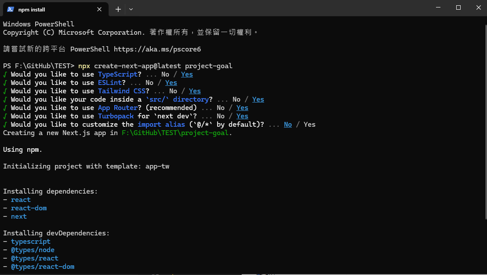
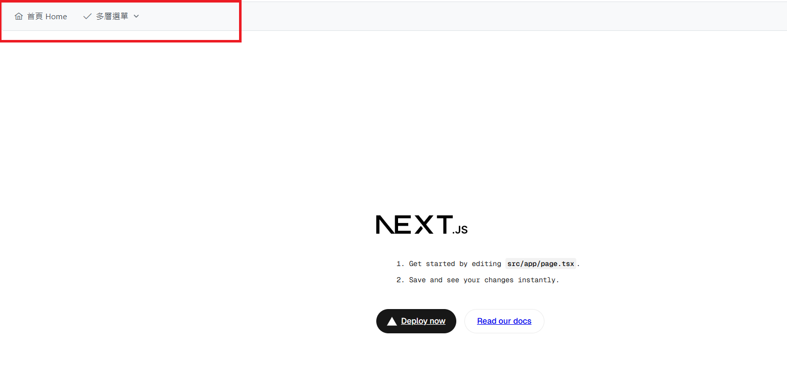
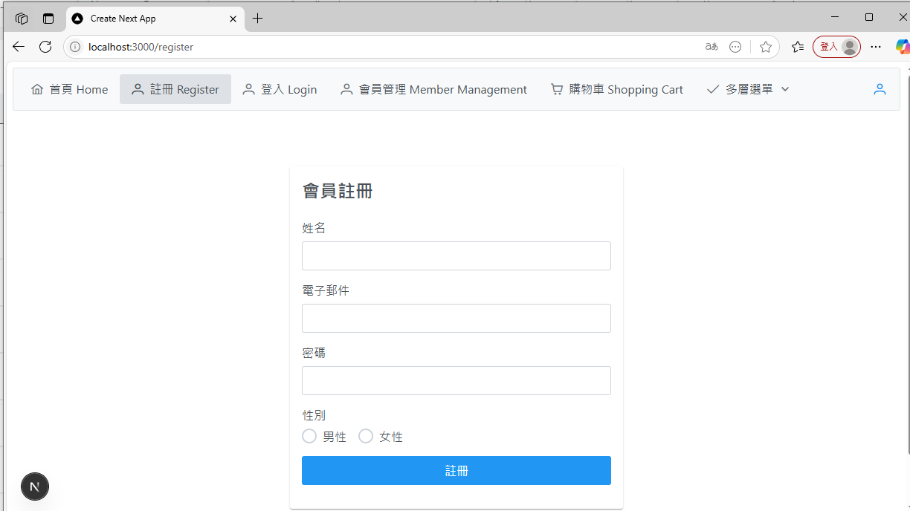
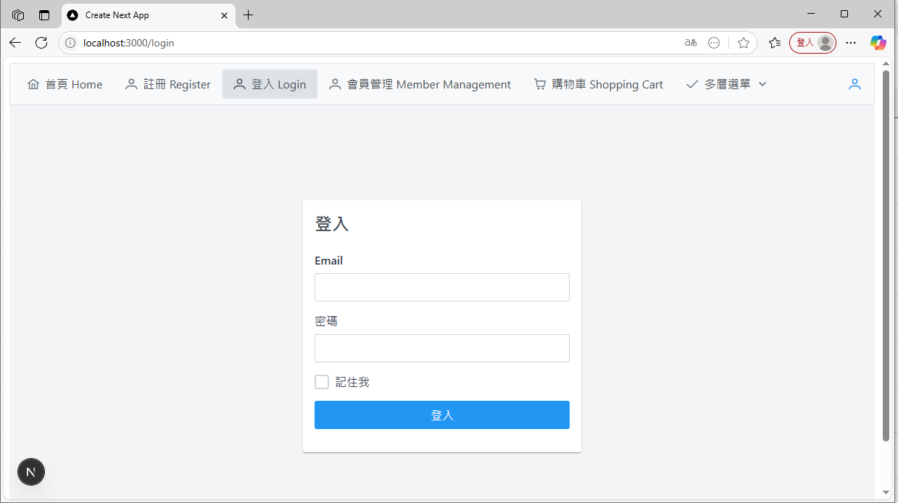
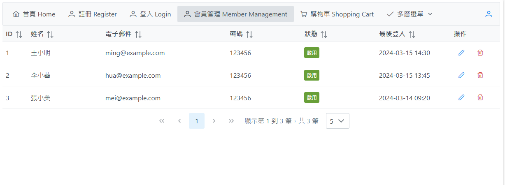
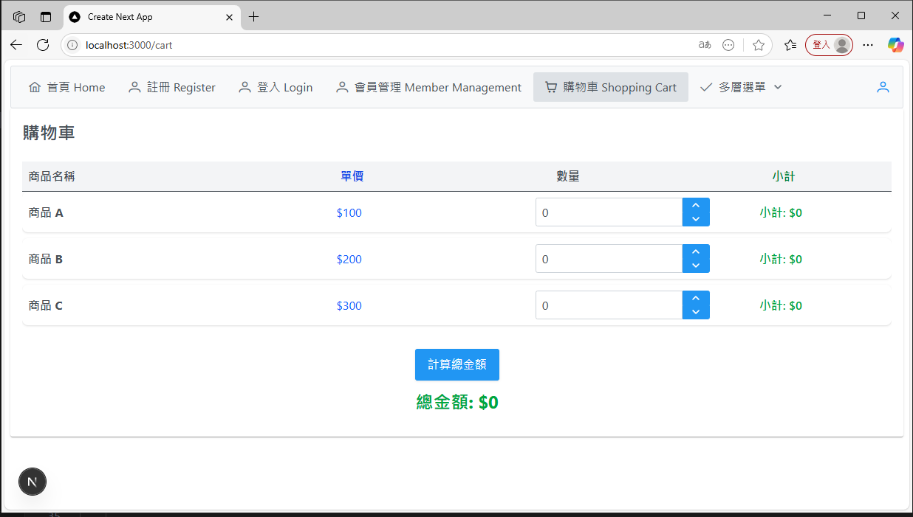

# 🧮 結束新手村-開始實作！

## 📚 課程概述 Course Overview

從這週開始，我們將會開始進行實作，從建立一個新的專案、初始化設定、建立導覽列、串接導航列頁面、實作各項功能。

### 課程目標

[Goal.md](../../Goal.md)

### 1. 🚀 開新專案

#### 📌 建立專案

請先建立一個新的專案 請使用 小寫英文作為專案名稱

```bash
npx create-next-app@latest project-goal
```



#### 📦 安裝依賴

進入資料夾並安裝 PrimeReact Icons

```bash
cd project-goal
npm install primereact primeicons
```

#### 🎨 修改 CSS 設定

##### 1️⃣ 引入 PrimeReact CSS

在 `src\app\layout.tsx` 貼上 CSS

```tsx
import "primereact/resources/themes/saga-blue/theme.css";
import "primereact/resources/primereact.min.css";
import "primeicons/primeicons.css";
```

##### 2️⃣ 修改 globals.css

```css
/* @import "tailwindcss"; */

@layer theme, base, components, utilities;
@import "tailwindcss/theme.css" layer(theme);
@import "tailwindcss/utilities.css" layer(utilities);
```

#### 🧩 建立導覽列

##### 1️⃣ 建立必要資料夾

在 `src\` 資料夾中建立 `components` 資料夾
在 `src\components` 中建立 `NavBar.tsx` 檔案

##### 2️⃣ 實作導覽列元件

```tsx
"use client";
import { Menubar } from "primereact/menubar";
import { Button } from "primereact/button";
import { useRouter } from "next/navigation";

export default function NavBar() {
  const router = useRouter();
  const items = [
    {
      label: "首頁 Home",
      icon: "pi pi-home",
      command: () => router.push("/"),
    },
    {
      label: "多層選單",
      icon: "pi pi-check",
      items: [
        {
          label: "頁面一",
          icon: "pi pi-plus",
          command: () => router.push("/page1"),
        },
        {
          label: "頁面二",
          icon: "pi pi-plus",
          command: () => router.push("/page2"),
        },
      ],
    },
  ];
  const end = (
    <div className="flex align-items-center gap-2">
      <Button icon="pi pi-user" rounded text />
    </div>
  );

  return (
    <div className="card">
      <Menubar model={items} end={end} />
    </div>
  );
}
```

##### 3️⃣ 整合導覽列

在 `src\app\layout.tsx` 中引入 NavBar，並在 `{children}` 之前加入 `<NavBar />` 元件

```tsx
import NavBar from "@/components/NavBar";

<>
  <NavBar />
  {children}
</>;
```

#### 🚀 啟動專案

使用 `npm run dev` 啟動專案並進行驗證成果


#### 📝 練習

請實作在 自己的 practice 專案

##### ✅ 建立 project-practice 專案

- 建立 project-practice 專案
- 安裝 PrimeReact PrimeIcons
- 設置 Tailwind CSS

### 2. 📝 串接導航列頁面

建立註冊頁面



#### 📌 建立註冊頁面

在 NavBar 中新增註冊頁面連結 `\src\components\NavBar.tsx`

```tsx
        {
            label: "註冊 Register",
            icon: "pi pi-user",
            command: () => router.push("/register"),
        },
```

在 `src\app\register\page.tsx` 中建立註冊頁面

```tsx
"use client";

import { useState } from "react";
import { Card } from "primereact/card";
import { InputText } from "primereact/inputtext";
import { RadioButton } from "primereact/radiobutton";
import { Button } from "primereact/button";

interface FormData {
  name: string; // 姓名
  email: string; // 電子郵件
  password: string; // 密碼
  gender: string; // 性別
}

export default function MemberForm() {
  // 表單狀態
  const [formData, setFormData] = useState<FormData>({
    name: "",
    email: "",
    password: "",
    gender: "",
  });

  // 處理表單提交
  const handleSubmit = (e: React.FormEvent<HTMLFormElement>) => {
    e.preventDefault();
    const formDataString =
      "姓名: " +
      formData.name +
      "\n" +
      "電子郵件: " +
      formData.email +
      "\n" +
      "密碼: " +
      formData.password +
      "\n" +
      "性別: " +
      formData.gender +
      "\n";
    alert("表單資料: \n" + formDataString);
  };

  return (
    // css flex: 使用 flexbox 來排版
    // justify-center: 水平置中
    // items-center: 垂直置中
    // min-h-screen: 最小高度為螢幕高度
    <div className="flex justify-center items-center min-h-screen">
      <Card title="會員註冊" className="w-full max-w-md">
        <form onSubmit={handleSubmit} className="flex flex-col gap-4">
          <div className="flex flex-col gap-2">
            <label htmlFor="name">姓名</label>
            <InputText
              id="name"
              value={formData.name}
              onChange={(e) =>
                setFormData({ ...formData, name: e.target.value })
              }
            />
          </div>

          <div className="flex flex-col gap-2">
            <label htmlFor="email">電子郵件</label>
            <InputText
              id="email"
              type="email"
              value={formData.email}
              onChange={(e) =>
                setFormData({ ...formData, email: e.target.value })
              }
            />
          </div>

          <div className="flex flex-col gap-2">
            <label htmlFor="password">密碼</label>
            <InputText
              id="password"
              type="password"
              value={formData.password}
              onChange={(e) =>
                setFormData({ ...formData, password: e.target.value })
              }
            />
          </div>

          <div className="flex flex-col gap-2">
            <label>性別</label>
            <div className="flex gap-4">
              <div className="flex items-center">
                <RadioButton
                  inputId="male"
                  name="gender"
                  value="male"
                  checked={formData.gender === "male"}
                  onChange={(e) =>
                    setFormData({ ...formData, gender: e.value })
                  }
                />
                <label htmlFor="male" className="ml-2">
                  男性
                </label>
              </div>
              <div className="flex items-center">
                <RadioButton
                  inputId="female"
                  name="gender"
                  value="female"
                  checked={formData.gender === "female"}
                  onChange={(e) =>
                    setFormData({ ...formData, gender: e.value })
                  }
                />
                <label htmlFor="female" className="ml-2">
                  女性
                </label>
              </div>
            </div>
          </div>
          <Button type="submit" label="註冊" className="mt-4" />
        </form>
      </Card>
    </div>
  );
}
```

#### 📝 驗證成果

訪問 `http://localhost:3000/register` 進行驗證成果

#### ✅ 練習

請實作在 自己的 practice 專案

##### ➕ 新增聯絡人

- 📝 姓名
- 📞 電話
- 👥 學制
- 📧 電子郵件
- 📝 備註

### 3. 📝 實作登入功能

#### 📌 建立登入頁面



在 NavBar 中新增登入頁面連結 `\src\components\NavBar.tsx`

```tsx
{
    label: "登入 Login",
    icon: "pi pi-user",
    command: () => router.push("/login"),
},
```

在 `src\app\login\page.tsx` 中建立登入頁面

```tsx
"use client";
import { useState } from "react";
import { Card } from "primereact/card";
import { InputText } from "primereact/inputtext";
import { Checkbox } from "primereact/checkbox";
import { Button } from "primereact/button";

interface FormData {
  email: string; // 帳號
  password: string; // 密碼
  rememberMe: boolean; // 記住我
}
export default function LoginForm() {
  const [formData, setFormData] = useState<FormData>({
    email: "",
    password: "",
    rememberMe: false,
  });

  const handleSubmit = (e: React.FormEvent<HTMLFormElement>) => {
    e.preventDefault();
    alert(
      `登入資訊：\nEmail：${formData.email}\n密碼：${formData.password}\n記住我：${formData.rememberMe}\n\n歡迎回來 大美女！！`
    );
  };

  return (
    <div className="flex justify-center items-center min-h-screen bg-gray-100">
      <Card className="w-96" title="登入">
        <form onSubmit={handleSubmit} className="space-y-4">
          <div className="space-y-2">
            <label htmlFor="email" className="block font-medium text-gray-700">
              Email
            </label>
            <InputText
              id="email"
              value={formData.email}
              onChange={(e) =>
                setFormData({ ...formData, email: e.target.value })
              }
              className="w-full p-2 border border-gray-300 rounded-md focus:outline-none focus:ring-2 focus:ring-blue-500"
            />
          </div>
          <div className="space-y-2">
            <label
              htmlFor="password"
              className="block font-medium text-gray-700"
            >
              密碼
            </label>
            <InputText
              id="password"
              type="password"
              value={formData.password}
              onChange={(e) =>
                setFormData({ ...formData, password: e.target.value })
              }
              className="w-full p-2 border border-gray-300 rounded-md focus:outline-none focus:ring-2 focus:ring-blue-500"
            />
          </div>
          <div className="flex items-center">
            <Checkbox
              inputId="rememberMe"
              checked={formData.rememberMe}
              onChange={(e) =>
                setFormData({ ...formData, rememberMe: e.checked ?? false })
              }
            />
            <label htmlFor="rememberMe" className="ml-2 text-gray-700">
              記住我
            </label>
          </div>
          <Button
            label="登入"
            type="submit"
            className="w-full bg-blue-500 hover:bg-blue-600 text-white font-medium py-2 px-4 rounded-md transition-colors duration-200"
          />
        </form>
      </Card>
    </div>
  );
}
```

#### 📝 驗證成果

訪問 `http://localhost:3000/login` 進行驗證成果

#### ✅ 練習

請實作在 自己的 practice 專案

##### 👀 檢視聯絡人

- 🔍 查詢框
- 📊 查詢後顯示查詢結果
- 包含以下資訊：
  - 📝 姓名
  - 📞 電話
  - 👥 學制
  - 📧 電子郵件
  - 📝 備註

### 4. 📝 實作會員管理功能

#### 📌 建立會員管理頁面

本頁面以 PrimeReact 的 DataTable 元件 為主軸進行實作
並結合 PrimeReact 的 Tag 元件 進行狀態標籤的顯示



DataTable 元件
官方文件： [https://primereact.org/datatable/](https://primereact.org/datatable/)

### 1. 基本設定

**範例**

```tsx
            <DataTable
                value={users}
                paginator
                rows={5}
                rowsPerPageOptions={[5, 10, 25, 50]}
                paginatorTemplate="FirstPageLink PrevPageLink PageLinks NextPageLink LastPageLink CurrentPageReport RowsPerPageDropdown"
                currentPageReportTemplate="顯示第 {first} 到 {last} 筆，共 {totalRecords} 筆"
                className="p-datatable-sm"
            >
```

1. **引入必要元件**

   - 引入 DataTable 和 Column 元件

2. **資料綁定**

   - 使用 `value` 屬性設定資料來源
   - 例如：`value={users}`

### 2. 分頁功能設定

1. **基本分頁**

   - `paginator`：啟用分頁功能
   - `rows`：設定每頁顯示筆數
   - 例如：`rows={5}`

2. **分頁選項**

   - `rowsPerPageOptions`：設定每頁顯示筆數選項
   - 例如：`rowsPerPageOptions={[5, 10, 25, 50]}`

3. **分頁模板**

   - `paginatorTemplate`：設定分頁按鈕
   - 例如：`paginatorTemplate="FirstPageLink PrevPageLink PageLinks NextPageLink LastPageLink CurrentPageReport RowsPerPageDropdown"`

4. **分頁顯示格式**

   - `currentPageReportTemplate`：設定分頁資訊顯示格式
   - 例如：`currentPageReportTemplate="顯示第 {first} 到 {last} 筆，共 {totalRecords} 筆"`

### 3. 樣式設定

- `className`：設定 DataTable 的樣式
- 例如：`className="p-datatable-sm"`

### 4. 欄位設定（Column 元件）

1. **基本屬性**

   - `field`：設定資料來源欄位
   - `header`：設定欄位標題
   - `sortable`：啟用排序功能
   - `className`：設定欄位寬度

2. **範例**

```tsx
<Column field="email" header="電子郵件" sortable className="w-[25%]" />
```

Tag 元件
官方文件： [https://primereact.org/tag/](https://primereact.org/tag/)

在 NavBar 中新增會員管理頁面連結 `\src\components\NavBar.tsx`

```tsx
{
    label: "會員管理 Member Management",
    icon: "pi pi-user",
    command: () => router.push("/members"),
},
```

在 `src\app\members\page.tsx` 中建立會員管理頁面

```tsx
"use client";
import { useState } from "react";
import { DataTable } from "primereact/datatable";
import { Column } from "primereact/column";
import { Button } from "primereact/button";
import { Tag } from "primereact/tag";

interface User {
  id: number;
  name: string;
  email: string;
  status: string;
  password: string;
  lastLogin: string;
}

export default function UserList() {
  // 使用者資料
  const [users] = useState<User[]>([
    {
      id: 1,
      name: "王小明",
      email: "ming@example.com",
      password: "123456",
      status: "active",
      lastLogin: "2024-03-15 14:30",
    },
    {
      id: 2,
      name: "李小華",
      email: "hua@example.com",
      password: "123456",
      status: "active",
      lastLogin: "2024-03-15 13:45",
    },
    {
      id: 3,
      name: "張小美",
      email: "mei@example.com",
      password: "123456",
      status: "active",
      lastLogin: "2024-03-14 09:20",
    },
  ]);

  // 狀態標籤模板
  const statusTemplate = (rowData: User) => {
    return (
      <Tag
        value={rowData.status === "active" ? "啟用" : "停用"}
        severity={rowData.status === "active" ? "success" : "danger"}
      />
    );
  };

  // 操作按鈕模板
  const actionTemplate = (rowData: User) => {
    return (
      <div className="flex gap-2">
        <Button
          icon="pi pi-pencil"
          className="p-button-rounded p-button-text p-button-sm"
          tooltip="編輯"
          onClick={() => alert(`編輯 ${rowData.name}`)}
        />
        <Button
          icon="pi pi-trash"
          className="p-button-rounded p-button-text p-button-danger p-button-sm"
          tooltip="刪除"
          onClick={() => alert(`刪除 ${rowData.name}`)}
        />
      </div>
    );
  };

  return (
    <div className="card">
      <DataTable
        value={users}
        paginator
        rows={5}
        rowsPerPageOptions={[5, 10, 25, 50]}
        paginatorTemplate="FirstPageLink PrevPageLink PageLinks NextPageLink LastPageLink CurrentPageReport RowsPerPageDropdown"
        currentPageReportTemplate="顯示第 {first} 到 {last} 筆，共 {totalRecords} 筆"
        className="p-datatable-sm"
      >
        <Column field="id" header="ID" sortable className="w-[5%]" />
        <Column field="name" header="姓名" sortable className="w-[15%]" />
        <Column field="email" header="電子郵件" sortable className="w-[25%]" />
        <Column field="password" header="密碼" sortable className="w-[15%]" />
        <Column
          field="status"
          header="狀態"
          body={statusTemplate}
          sortable
          className="w-[15%]"
        />
        <Column
          field="lastLogin"
          header="最後登入"
          sortable
          className="w-[15%]"
        />
        <Column body={actionTemplate} header="操作" className="w-[10%]" />
      </DataTable>
    </div>
  );
}
```

#### 📝 驗證成果

訪問 `http://localhost:3000/members` 進行驗證成果

#### ✅ 練習

請實作在 自己的 practice 專案

##### 📋 聯絡人管理

可列出所有聯絡人，包含以下資訊：

- 📝 姓名
- 📞 電話
- 👥 學制
- 📧 電子郵件
- 📝 備註

### 5. 📝 實作購物車功能

使用 useState 搭配複雜的物件陣列 實作渲染計算
在 useState 中設定物件陣列 `products`初始值
使用.map 方式渲染 商品列表



#### 📌 建立購物車頁面

在 NavBar 中新增購物車頁面連結 `\src\components\NavBar.tsx`

```tsx
{
    label: "購物車 Shopping Cart",
    icon: "pi pi-shopping-cart",
    command: () => router.push("/cart"),
},
```

在 `src\app\cart\page.tsx` 中建立購物車頁面

```tsx
"use client";
import { useState } from "react";
import { InputNumber } from "primereact/inputnumber";
import { Button } from "primereact/button";
import { Card } from "primereact/card";

interface Product {
  id: number;
  name: string;
  price: number;
  quantity: number;
}

export default function ShoppingCart() {
  // 商品列表狀態
  const [products, setProducts] = useState<Product[]>([
    { id: 1, name: "商品 A", price: 100, quantity: 0 },
    { id: 2, name: "商品 B", price: 200, quantity: 0 },
    { id: 3, name: "商品 C", price: 300, quantity: 0 },
  ]);

  // 總金額狀態
  const [total, setTotal] = useState<number>(0);

  // 更新商品數量
  const updateQuantity = (id: number, quantity: number) => {
    setProducts(
      // 遍歷 products 陣列每一個商品 類似for迴圈
      products.map((product) =>
        // 如果商品 id 與要更新的 id 相同，則更新數量，否則保持原樣
        product.id === id ? { ...product, quantity } : product
      )
    );
  };

  // 計算總金額
  const calculateTotal = () => {
    let sum = 0; // 用來累加總金額
    for (const product of products) {
      sum += product.price * product.quantity;
    }
    setTotal(sum); // 設定總金額
  };

  return (
    <Card title="購物車" className="shadow-lg rounded-xl bg-slate-50">
      <div className="flex flex-col overflow-x-auto">
        {/* 標題列 */}
        <div className="flex flex-row items-center font-bold text-base border-b py-2 bg-gray-100">
          <div className="flex-1 text-left pl-2">商品名稱</div>
          <div className="flex-1 text-blue-700 text-center">單價</div>
          <div className="flex-1 text-center">數量</div>
          <div className="flex-1 text-green-700 text-center">小計</div>
        </div>
        {products.map((product) => (
          <div
            key={product.id}
            className="flex flex-row items-center rounded-lg shadow mb-2 bg-white gap-2 p-2"
          >
            <div className="flex-1 font-bold">{product.name}</div>
            <div className="flex-1 text-blue-600 text-center">
              ${product.price}
            </div>
            <div className="flex-1 flex justify-center">
              <InputNumber
                value={product.quantity}
                onValueChange={(e) => updateQuantity(product.id, e.value || 0)}
                showButtons
                min={0}
                max={10}
                className="w-20"
              />
            </div>
            <div className="flex-1 text-green-600 font-semibold text-center">
              小計: ${product.price * product.quantity}
            </div>
          </div>
        ))}
        <div className="flex flex-col items-center mt-6 gap-3">
          <Button
            label="計算總金額"
            onClick={calculateTotal}
            className="rounded-full px-8 py-3 text-lg bg-blue-500 hover:bg-blue-600 text-white font-semibold shadow"
          />
          <div className="text-2xl font-bold text-green-600">
            總金額: ${total}
          </div>
        </div>
      </div>
    </Card>
  );
}
```

#### 📝 驗證成果

訪問 `http://localhost:3000/cart` 進行驗證成果

#### ✅ 練習

請實作在 自己的 practice 專案

##### 📋 訂單填寫

包含以下欄位：

- 📦 品名
- 🔢 數量
- 💰 單價
- 📊 小計(自動計算)
- 💵 總計(自動計算)

##### 📋 訂單明細

- 📤 送出訂單後顯示訂單明細

## 📝 延伸閱讀

1. 頁面驗證登入狀態的機制
2. React Context API 是什麼
3. 響應式設計的實作技巧 Tailwind CSS 的響應式設計
4. 試著做出自己喜歡的 css Class 讓每次使用元件時 可以直接套用。 以下推薦一個 容器需要包含多元素 的 CSS
   ```
   .flex-items {
       align-items: center;
       display: flex;
       flex-direction: row;
       flex-wrap: wrap;
       justify-content: flex-start;
       white-space: nowrap;
   }
   ```
5. 嘗試著將過去的功能做成 Component 讓 Page.tsx 引用 讓同樣的元件可以重複使用
