# 第一週：React 開發環境與基礎語法初探

Week 1: React Development Environment and Basic Syntax Introduction


## 課程概述 Course Overview

本週將介紹 React 開發環境的設置，學習 TypeScript 基礎語法，並完成第一個 React 應用程式。我們會從環境設置開始，到理解 JSX 語法，並實作簡單的互動功能。
This week introduces React development environment setup, TypeScript basic syntax, and completing our first React application. We'll start from environment setup to understanding JSX syntax, and implement simple interactive features.

## 章節 Chapters

1. 開發環境安裝與設置
   Development Environment Installation and Setup
2. TypeScript 基礎語法
   TypeScript Basic Syntax
3. JSX 語法介紹
   JSX Syntax Introduction
4. React 事件處理
   React Event Handling
5. 實作練習：按鈕互動
   Practice: Button Interaction

## 課程內容 Course Content

### 1. 開發環境安裝與設置

Development Environment Installation and Setup

#### **必要工具安裝 Required Tools Installation**

- Node.js 安裝
  Node.js Installation
  [https://nodejs.org/](https://nodejs.org/)
  
- VS Code 安裝
  VS Code Installation
  [https://code.visualstudio.com/](https://code.visualstudio.com/)
- 

#### **擴充套件安裝 Essential Extensions**

- Chinese (Traditional) Language Pack
- TypeScript React code snippets
- Tailwind CSS IntelliSense
- Prettier - Code formatter
- Office Viewer

  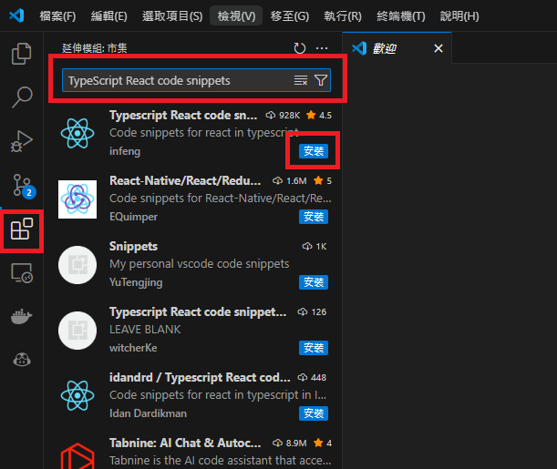

#### **專案初始化 Project Initialization**

在你要建立專案的地方 在上方路徑的地方輸入"cmd" 開啟指令頁面

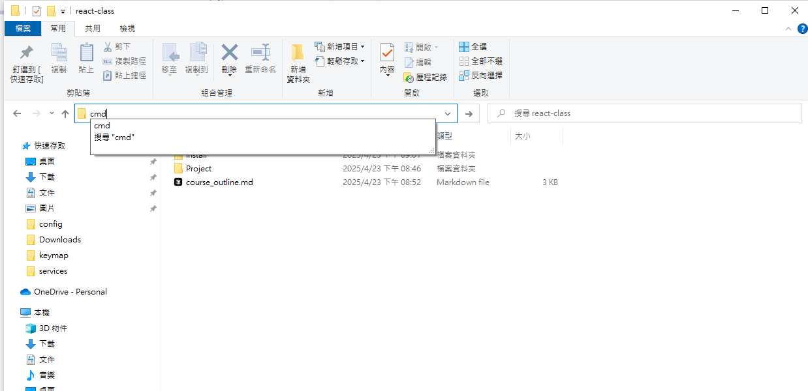

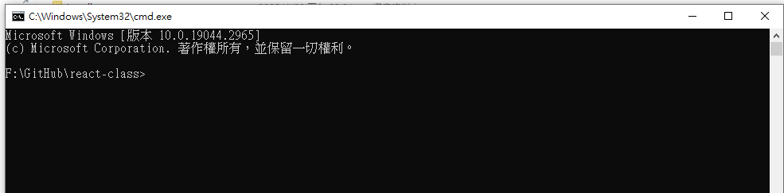

#### **使用 Create Next App 建立 React + TypeScript 專案**

Create React + TypeScript project using Create Next App

```bash
# 使用 Create React App 建立 React + TypeScript 專案
# Create React + TypeScript project using Create React App
npx create-next-app@latest project10543024


# 進入專案資料夾
cd project10543024

# 安裝UI框架 PrimeReact
npm install primereact primeicons


```

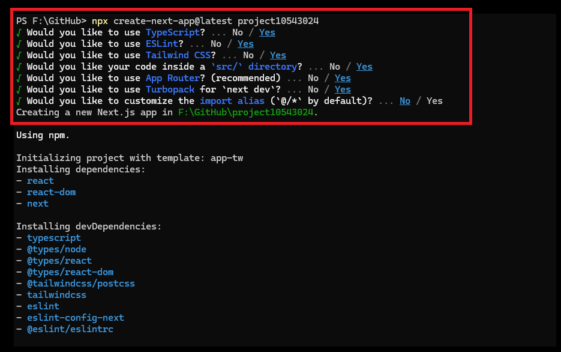

將剛剛產生的資料夾拖入 VSCode 中
Drag the generated folder into VSCode

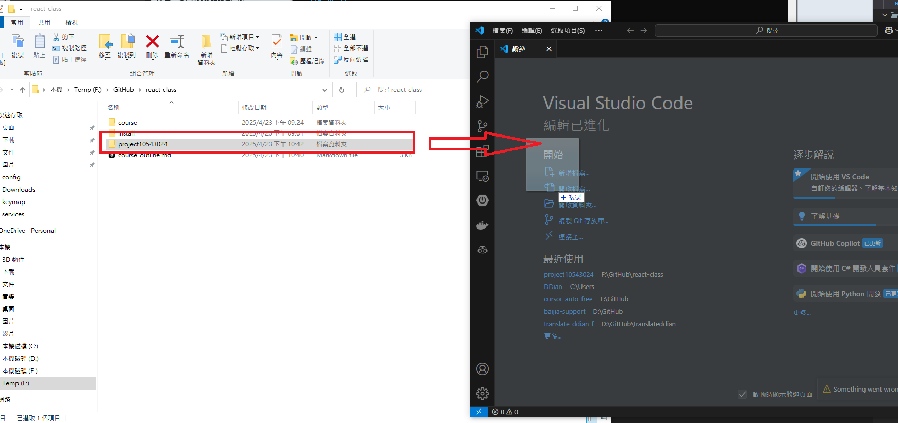

開好專案了!
The project is ready!

##### 打開終端

Open terminal

在 VSCode 中，你可以透過以下方式開啟終端機：

1. 使用快捷鍵：

   - Windows: Ctrl + \`
   - Mac: Cmd + \`
2. 從選單開啟：

   - 點選上方選單的「終端機」(Terminal) > 「新增終端機」(New Terminal)
3. 使用命令選擇區：

   - 按下 `Ctrl + Shift + P` (Windows) 或 `Cmd + Shift + P` (Mac)
   - 輸入 "terminal" 並選擇「建立新的整合式終端機」

開啟終端機後，確保你位於專案根目錄，接著就可以開始安裝所需的套件。

In VSCode, you can open the terminal through:

1. Keyboard shortcut:

   - Windows: Ctrl + \`
   - Mac: Cmd + \`
2. From menu:

   - Click "Terminal" > "New Terminal" from the top menu
3. Using command palette:

   - Press `Ctrl + Shift + P` (Windows) or `Cmd + Shift + P` (Mac)
   - Type "terminal" and select "Create New Integrated Terminal"

After opening the terminal, ensure you are in the project root directory, then you can start installing the required packages.

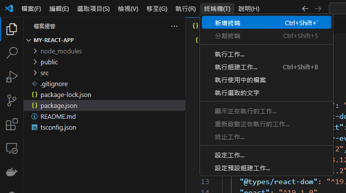

##### 打開網頁

Open webpage

在終端機中執行以下指令來啟動開發伺服器：
Execute the following command in terminal to start the development server:

```bash
npm run dev
```

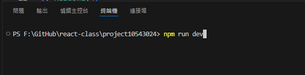

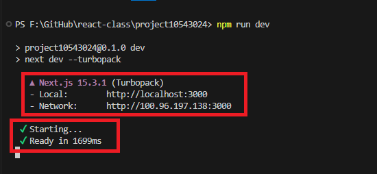

`src\app\page.tsx` 是 React 的頁面元件，是 React 的入口點。
`src\app\page.tsx` is a React page component and serves as the entry point for React.

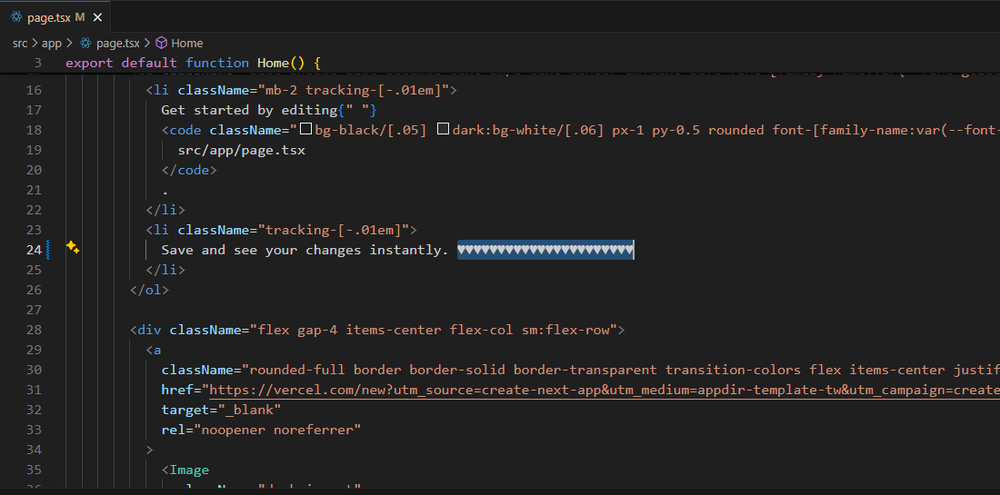

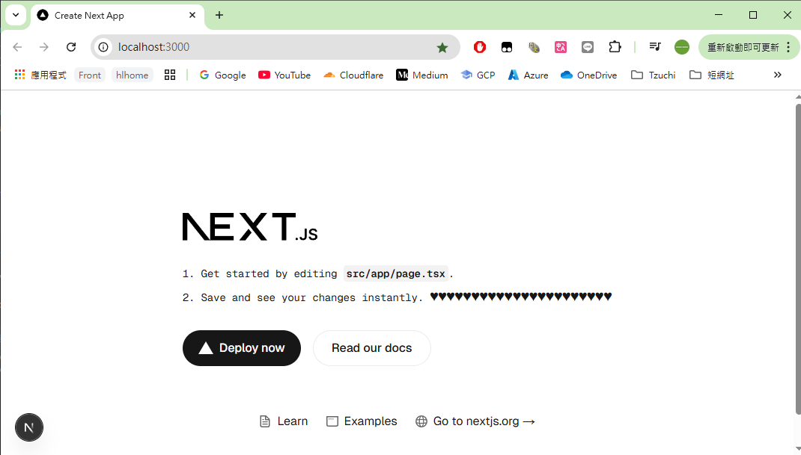

### 2. TypeScript 基礎語法

TypeScript Basic Syntax

#### **基本型別 Basic Types**

```ts
// 字串 String
const name: string = "小明";
let name: string = "小明";

// 數字 Number
const age: number = 25;
let age: number = 25;

// 布林值 Boolean
const isStudent: boolean = true;
let isStudent: boolean = true;

// 陣列 Array
const numbers: number[] = [1, 2, 3];
let numbers: number[] = [1, 2, 3];

const names: string[] = ["小明", "小華"];
let names: string[] = ["小明", "小華"];

// 物件 Object
interface Person {
  name: string;
  age: number;
}

let person: Person = {
  name: "小明",
  age: 25,
};
```

##### 常數(或變數)渲染 Constant (or Variable) Rendering

在 React 中，我們可以透過大括號 `{}` 來渲染常數或變數的值。這是一個基本的渲染方式，讓我們可以在 JSX 中動態顯示資料。
In React, we can render the value of constants or variables using curly braces `{}`. This is a basic rendering method that allows us to dynamically display data in JSX.

請試著在 `src\app\page.tsx` 中修改以下內容：
Try to modify the following content in `src\app\page.tsx`:

```ts
export default function Home() {
  // 程式碼
  // Code
  const Hello = "Hello";
  let Message = "";
  Message = "---Hello World---";

  // 渲染區
  // Render
  return (
    <div>
      <div>{Hello}</div>
      <div>{Message}</div>
    </div>
  );
}
```

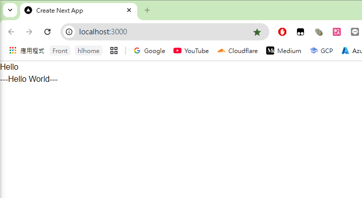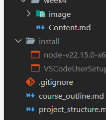

#### **條件判斷 Conditional Statements**

```typescript
export default function Home() {
  const age = 18;
  // if-else 語句
  if (age >= 18) {
    console.log("已成年");
  } else {
    console.log("未成年");
  }

  // 三元運算子
  const status = age >= 18 ? "已成年" : "未成年";

  // 渲染區
  // Render
  return (
    <div>
      <div>{status}</div>
    </div>
  );
}
```

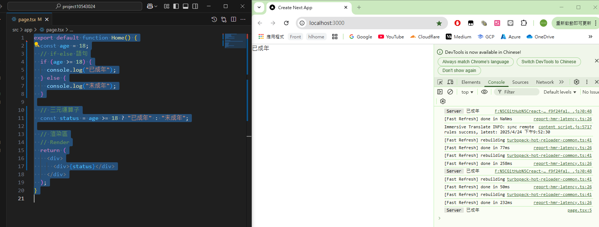

### 3. JSX 語法介紹

JSX Syntax Introduction

#### **基本 JSX 元素 Basic JSX Elements**

```tsx

interface Person {
  name: string;
  age: number;
}

let person: Person = {
  name: "小明",
  age: 25,
};

function Greeting() {
  const name = "小明";
  return (
    <>
      <h2>你好，{person.name}！</h2>
      <h2>你好，{person.age}！</h2>

    </>
  );
}

export default function Home() {
  return (
    <div className="container">
      <h1>歡迎來到 React 課程</h1>
      <p>這是我的第一個 React 應用程式</p>
      {Greeting()}
    </div>
  );
}

```

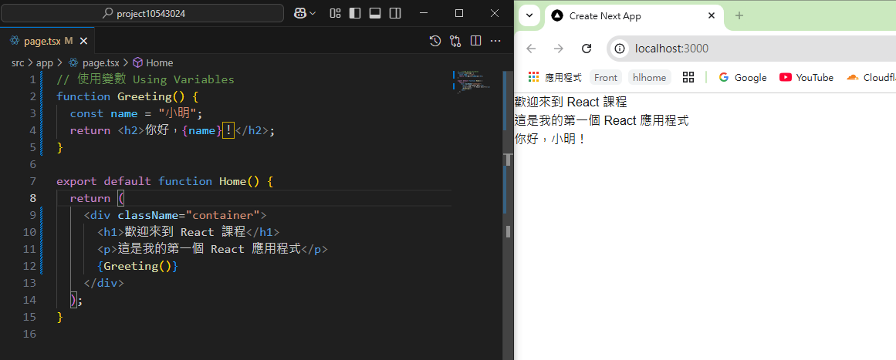

#### **條件渲染 Conditional Rendering**

```tsx
function WelcomeMessageFuntion(isLoggedIn: boolean) {
  return <div>{isLoggedIn ? <h1>歡迎回來！</h1> : <h1>請先登入</h1>}</div>;
}
function WelcomeMessageComponent({ isLoggedIn }: { isLoggedIn: boolean }) {
  return <div>{isLoggedIn ? <h1>歡迎回來！</h1> : <h1>請先登入</h1>}</div>;
}

export default function Home() {
  return (
    <div className="container">
      <h1>歡迎來到 React 課程</h1>
      <p>這是我的第一個 React 應用程式</p>
      <h2>{WelcomeMessageFuntion(false)}</h2>
      <WelcomeMessageComponent isLoggedIn={true} />
    </div>
  );
}
```

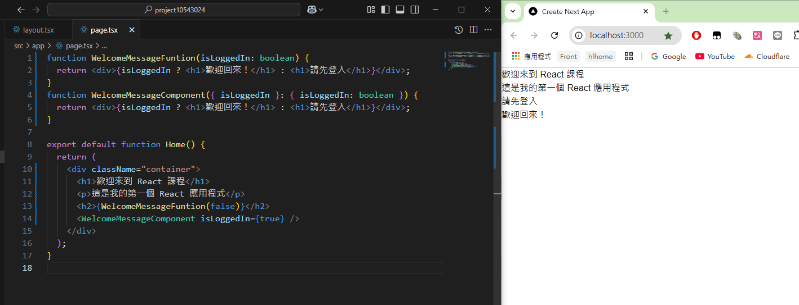

### 4. React 事件處理

React Event Handling

補上 CSS
在 `src\app\layout.tsx` 貼上 CSS
Paste CSS in `src\app\layout.tsx`

```ts
import "primereact/resources/themes/saga-blue/theme.css";
import "primereact/resources/primereact.min.css";
import "primeicons/primeicons.css";
```

修改 globals.css

```css
/* @import "tailwindcss"; */

@layer theme, base, components, utilities;
@import "tailwindcss/theme.css" layer(theme);
@import "tailwindcss/utilities.css" layer(utilities);
```

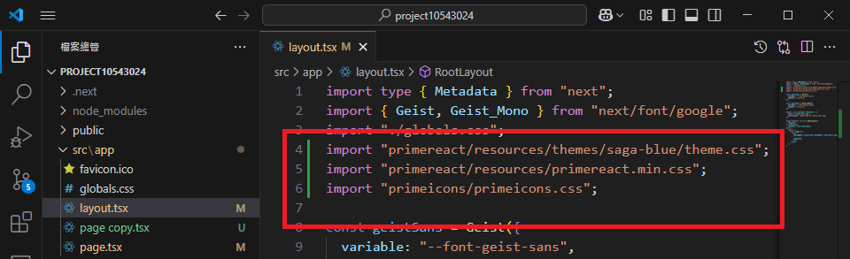

#### **基本事件處理 Basic Event Handling**

ICON:[https://primereact.org/icons/](https://primereact.org/icons/)

```tsx
"use client";
import { Button } from "primereact/button";

function handleClick() {
  alert("Button clicked 按鈕被點擊了");
  return;
}
export default function Home() {
  return (
    <div>
      <Button label="Click me  按下我" icon="pi pi-car" onClick={handleClick} />
    </div>
  );
}
```

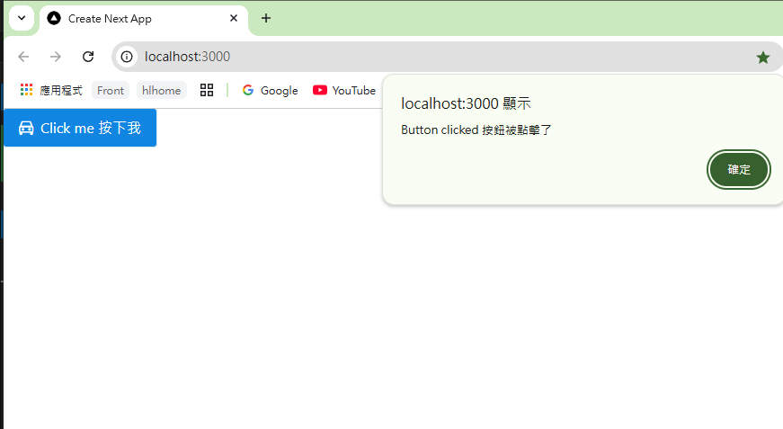

#### **練習題目 Practice Tasks**

1. 使用 **常數(或變數)渲染** 渲染出 `Hello World!`
   Use **constant (or variable) rendering** to render `Hello World!`
2. 寫一個 Funtion ，傳入參數 `小明` 渲染出 `小明 你好 !`
   Write a Function that takes a parameter `John` and renders `Hello John`
3. 寫一個按鈕，按下去會顯示 `新年快樂`
   Write a button that displays `Happy New Year` when clicked

#### 提示

#### Hints

```ts
return (
  <div className="container">
    <h1>{strHello}</h1>
    <h2>{returnHello("小明")}</h2>
    <Button label="Click me  按下我" icon="pi pi-car" onClick={handleClick} />
  </div>
);
```

#### **範例解答 Example Solution**

```tsx

```

## 課程重點

Course Highlights

1. **開發環境設置** ⚙️

   - Node.js 和 VS Code 的安裝與配置
   - 使用 Create Next App 建立 React + TypeScript 專案
   - 安裝必要的擴充套件和 UI 框架
2. **TypeScript 基礎** 💻

   - 基本型別（string、number、boolean、array、object）
   - 變數宣告與使用
   - 介面（Interface）的定義與應用
3. **JSX 語法** 📝

   - JSX 的基本結構與語法規則
   - 變數在 JSX 中的使用方式
   - 條件渲染的實現方法
   - 元件的定義與使用
4. **React 事件處理** 🖱️

   - 基本事件處理器的使用
   - 狀態管理與更新
   - 按鈕互動功能的實現
5. **實作練習** ✅

   - 變數渲染練習
   - 函式元件實作

## 課程總結

Course Summary

本週我們完成了 React 開發環境的設置，學習了 TypeScript 和 JSX 的基礎語法，並實作了簡單的互動功能。這些基礎知識將為後續課程打下堅實的基礎，特別是在開發更複雜的應用時，這些概念將幫助我們更好地組織和管理程式碼。

This week, we completed the setup of the React development environment, learned the basic syntax of TypeScript and JSX, and implemented simple interactive features. These foundational knowledge will lay a solid foundation for subsequent courses, especially when developing more complex applications, these concepts will help us better organize and manage code.

## 下週預告

Next Week Preview

下週我們將學習如何建立導覽列（Navbar）和頁面切換功能，並深入探討 Tailwind CSS 的應用。

Next week, we will learn how to create a navigation bar (Navbar) and page switching functionality, and explore the application of Tailwind CSS in depth.
