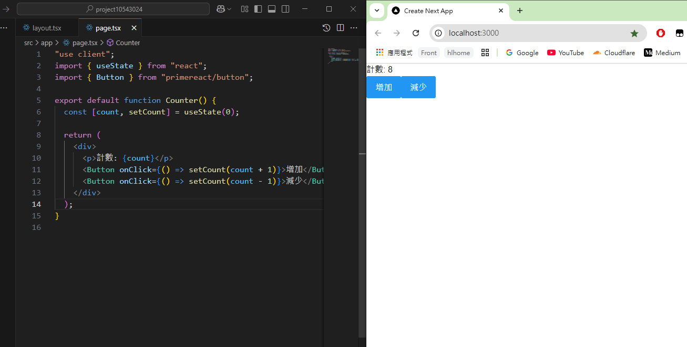

# 🎯 第二週：React 核心概念與 PrimeReact 元件應用

Week 2: React Core Concepts and PrimeReact Components

## 📚 課程概述 Course Overview

本週將深入探討 React 的核心概念，包括組件設計與 Props 傳遞，並學習使用 PrimeReact 的基礎元件來建立更豐富的用戶界面。我們將從基礎的組件概念開始，逐步學習如何建立可重用的組件，並使用 PrimeReact 的各種元件來增強應用程式的功能與外觀。

This week we will delve into React's core concepts, including component design and Props passing, and learn to use PrimeReact's basic components to create richer user interfaces. We'll start with basic component concepts and gradually learn how to create reusable components, using various PrimeReact components to enhance application functionality and appearance.

## 📑 章節 Chapters

1. 🧩 React 組件概念與 Props 傳遞
   React Component Concepts and Props Passing
2. 🔄 useState 基礎應用
   Basic useState Application
3. 🎨 PrimeReact 基礎元件教學
   PrimeReact Basic Components Tutorial
4. ✍️ 實作練習：會員註冊表單
   Practice: Member Registration Form

## 📝 課程內容 Course Content

### 1. 🧩 React 組件概念與 Props 傳遞

React Component Concepts and Props Passing

#### **組件基礎概念 Basic Component Concepts**

在 React 中，組件是構建用戶界面的基本單位。組件可以是函數或類，它們接收輸入（稱為 props）並返回描述應該在屏幕上顯示的內容的 React 元素。

In React, components are the basic building blocks of user interfaces. Components can be functions or classes, they receive inputs (called props) and return React elements that describe what should appear on the screen.

```tsx
import React from "react";

// 函數組件 Function Component
function Welcome(props: { name: string; age: number }) {
  return (
    <h1>
      Hello, {props.name} {props.age} 歲
    </h1>
  );
}

// 使用組件 Using Component
export default function Home() {
  return (
    <div>
      <Welcome name="小明" age={16} />
      <Welcome name="小華" age={30} />
    </div>
  );
}

```

#### **Props 傳遞與使用 Props Passing and Usage**

Props 是組件之間傳遞數據的主要方式。它們是只讀的，這意味著組件不能修改其 props。

Props are the primary way to pass data between components. They are read-only, meaning a component cannot modify its props.


```tsx
// 定義組件 Define Component
function UserCard({ name, age, isStudent }) {
  return (
    <div className="card">
      <h2>{name}</h2>
      <p>年齡: {age}</p>
      <p>身份: {isStudent ? "學生" : "非學生"}</p>
    </div>
  );
}

// 使用組件 Using Component
export default function Home() {
  return (
    <div>
      <UserCard name="小明" age={20} isStudent={true} />
      <UserCard name="小華" age={25} isStudent={false} />
    </div>
  );
}
```

### 2. 🔄 useState 基礎應用

Basic useState Application

#### **狀態管理基礎 Basic State Management**

useState 是 React 的一個 Hook，它允許我們在函數組件中添加狀態。

useState is a React Hook that allows us to add state to function components.



```tsx
"use client";
import { useState } from "react";

export default function Counter() {
  const [count, setCount] = useState(0);

  return (
    <div>
      <p>計數: {count}</p>
      <button onClick={() => setCount(count + 1)}>增加</button>
      <button onClick={() => setCount(count - 1)}>減少</button>
    </div>
  );
}
```

#### **多個狀態管理 Multiple State Management**

我們可以在一個組件中使用多個 useState。

We can use multiple useState in one component.

```tsx
"use client";
import { useState } from "react";

export default function UserForm() {
  const [name, setName] = useState("");
  const [age, setAge] = useState(0);
  const [isStudent, setIsStudent] = useState(false);

  return (
    <div>
      <input
        type="text"
        value={name}
        onChange={(e) => setName(e.target.value)}
        placeholder="姓名"
      />
      <input
        type="number"
        value={age}
        onChange={(e) => setAge(Number(e.target.value))}
        placeholder="年齡"
      />
      <input
        type="checkbox"
        checked={isStudent}
        onChange={(e) => setIsStudent(e.target.checked)}
      />
      <label>是否為學生</label>
    </div>
  );
}
```

### 3. 🎨 PrimeReact 基礎元件教學

PrimeReact Basic Components Tutorial

#### **Card 元件 Card Component**

Card 元件用於展示內容，通常包含標題、內容和頁尾。

Card component is used to display content, usually containing a title, content, and footer.

```tsx
"use client";
import { Card } from "primereact/card";

export default function ProductCard() {
  return (
    <Card
      title="商品名稱"
      subTitle="商品描述"
      style={{ width: "25rem", marginBottom: "2em" }}
    >
      <p className="m-0">
        這是一個商品卡片，可以用來展示商品資訊。
      </p>
    </Card>
  );
}
```

#### **Button 元件 Button Component**

Button 元件提供多種樣式和功能。

Button component provides various styles and functions.

```tsx
"use client";
import { Button } from "primereact/button";

export default function ButtonDemo() {
  return (
    <div>
      <Button label="主要按鈕" />
      <Button label="次要按鈕" severity="secondary" />
      <Button label="成功按鈕" severity="success" />
      <Button label="警告按鈕" severity="warning" />
      <Button label="危險按鈕" severity="danger" />
    </div>
  );
}
```

#### **InputText 元件 InputText Component**

InputText 元件用於文字輸入。

InputText component is used for text input.

```tsx
"use client";
import { InputText } from "primereact/inputtext";
import { useState } from "react";

export default function InputDemo() {
  const [value, setValue] = useState("");

  return (
    <div>
      <InputText
        value={value}
        onChange={(e) => setValue(e.target.value)}
        placeholder="請輸入文字"
      />
    </div>
  );
}
```

### 4. ✍️ 實作練習：會員註冊表單

Practice: Member Registration Form

#### **練習題目 Practice Tasks**

1. 📦 使用 Card 元件建立會員註冊表單的容器
2. ✏️ 使用 InputText 元件建立姓名、電子郵件和密碼輸入欄位
3. 🔘 使用 RadioButton 元件建立性別選擇
4. ✅ 使用 Checkbox 元件建立興趣選擇
5. 🎯 使用 Button 元件建立提交按鈕
6. 🔄 使用 useState 管理表單狀態

#### **提示 Hints**

```tsx
"use client";
import { Card } from "primereact/card";
import { InputText } from "primereact/inputtext";
import { RadioButton } from "primereact/radiobutton";
import { Checkbox } from "primereact/checkbox";
import { Button } from "primereact/button";
import { useState } from "react";

export default function RegistrationForm() {
  // 使用 useState 管理表單狀態
  // Use useState to manage form state

  return (
    <Card title="會員註冊" style={{ width: "25rem", marginBottom: "2em" }}>
      {/* 表單內容 */}
      {/* Form content */}
    </Card>
  );
}
```

## 🎯 課程重點

Course Highlights

1. **React 組件概念** 🧩

   - 組件的定義與使用
   - Props 的傳遞與接收
   - 組件的可重用性
2. **狀態管理** 🔄

   - useState Hook 的使用
   - 多個狀態的管理
   - 狀態更新與渲染
3. **PrimeReact 元件** 🎨

   - Card 元件的應用
   - Button 元件的樣式與事件
   - InputText 元件的使用
   - 其他基礎元件的介紹
4. **實作練習** ✅

   - 會員註冊表單的建立
   - 表單狀態的管理
   - 元件的整合應用

## 📝 課程總結

Course Summary

本週我們學習了 React 的核心概念，包括組件設計和 Props 傳遞，並深入了解了 useState Hook 的使用。同時，我們也學習了 PrimeReact 的基礎元件，並通過實作會員註冊表單來整合這些知識。這些基礎知識將幫助我們在後續課程中建立更複雜的應用程式。

This week we learned React's core concepts, including component design and Props passing, and gained a deeper understanding of the useState Hook. We also learned about PrimeReact's basic components and integrated this knowledge by implementing a member registration form. These foundational concepts will help us build more complex applications in subsequent courses.

## 🔜 下週預告

Next Week Preview

下週我們將學習進階狀態管理與計算功能，包括多個 useState 的整合、計算邏輯的實作，以及使用 PrimeReact 的進階元件。

Next week, we will learn about advanced state management and calculation functions, including the integration of multiple useState, implementation of calculation logic, and the use of PrimeReact's advanced components.
