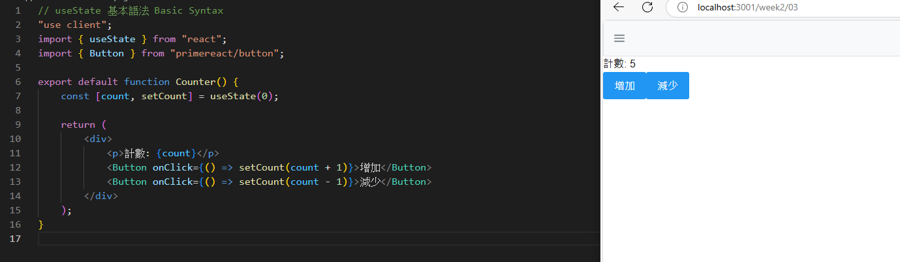
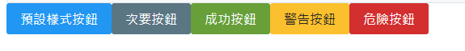
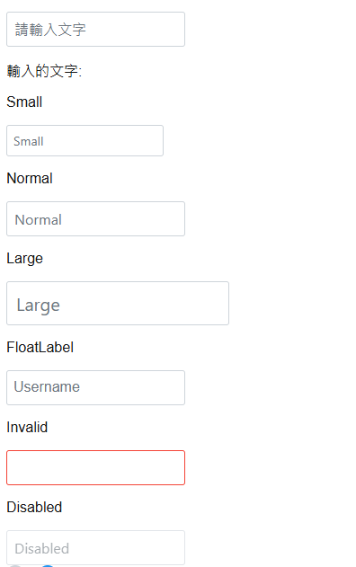
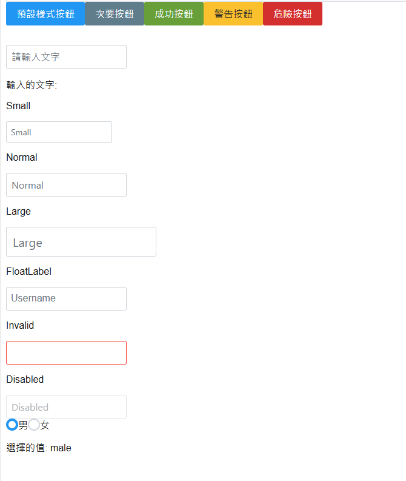
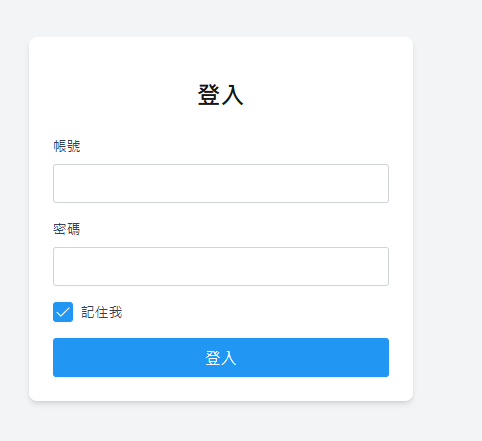

# 🎯 第二週：React 核心概念與 PrimeReact 元件應用

Week 2: React Core Concepts and PrimeReact Components

## 📚 課程概述 Course Overview

本週將深入探討 React 的核心概念，包括組件設計與 Props 傳遞，並學習使用 PrimeReact 的基礎元件來建立更豐富的用戶界面。我們將從基礎的組件概念開始，逐步學習如何建立可重用的組件，並使用 PrimeReact 的各種元件來增強應用程式的功能與外觀。

This week we will delve into React's core concepts, including component design and Props passing, and learn to use PrimeReact's basic components to create richer user interfaces. We'll start with basic component concepts and gradually learn how to create reusable components, using various PrimeReact components to enhance application functionality and appearance.

## 📑 章節 Chapters

1. 🧩 React 組件概念與 Props 傳遞
   React Component Concepts and Props Passing
2. 🔄 useState 基礎應用
   Basic useState Application
3. 🎨 PrimeReact 基礎元件教學
   PrimeReact Basic Components Tutorial
4. ✍️ 實作練習：會員註冊表單
   Practice: Member Registration Form

## 📝 課程內容 Course Content

### 1. 🧩 React 組件概念與 Props 傳遞

React Component Concepts and Props Passing

#### **組件基礎概念 Basic Component Concepts**

在 React 中，組件是構建用戶界面的基本單位。組件可以是函數或類，它們接收輸入（稱為 props）並返回描述應該在屏幕上顯示的內容的 React 元素。

In React, components are the basic building blocks of user interfaces. Components can be functions or classes, they receive inputs (called props) and return React elements that describe what should appear on the screen.


```tsx
import React from "react";

// 函數組件 Function Component
function Welcome(props: { name: string; age: number }) {
  return (
    <h1>
      Hello, {props.name} {props.age} 歲
    </h1>
  );
}

// 使用組件 Using Component
export default function Home() {
  return (
    <div>
      <Welcome name="小明" age={16} />
      <Welcome name="小華" age={30} />
    </div>
  );
}

```

#### **Props 傳遞與使用 Props Passing and Usage**

Props 是組件之間傳遞數據的主要方式。它們是只讀的，這意味著組件不能修改其 props。

Props are the primary way to pass data between components. They are read-only, meaning a component cannot modify its props.


```tsx
// 定義組件 Define Component
function UserCard({ name, age, isStudent }) {
  return (
    <div className="card">
      <h2>{name}</h2>
      <p>年齡: {age}</p>
      <p>身份: {isStudent ? "學生" : "非學生"}</p>
    </div>
  );
}

// 使用組件 Using Component
export default function Home() {
  return (
    <div>
      <UserCard name="小明" age={20} isStudent={true} />
      <UserCard name="小華" age={25} isStudent={false} />
    </div>
  );
}
```

##### **Props 的兩種寫法比較 Comparison of Two Props Writing Styles**

1. **使用 props 參數的寫法 Using props parameter**:

```tsx
function Welcome(props: { name: string; age: number }) {
  return (
    <h1>
      Hello, {props.name} {props.age} 歲
    </h1>
  );
}
```

2. **使用解構賦值的寫法 Using destructuring assignment**:

```tsx
function UserCard({ name, age, isStudent }) {
  return (
    <div className="card">
      <h2>{name}</h2>
      <p>年齡: {age}</p>
      <p>身份: {isStudent ? "學生" : "非學生"}</p>
    </div>
  );
}
```

**兩種寫法的主要差異：**

- **解構賦值寫法更簡潔，直接使用變數名稱**
- **props 參數寫法需要加上 `props.` 前綴**
- **解構賦值寫法可以立即看出組件需要哪些 props**

**建議：**

* **如果 props 較少（2-3個），建議使用解構賦值寫法**
* **如果 props 較多，建議使用 props 的寫法，並配合 TypeScript 介面定義**
* **在團隊開發中，建議統一使用一種寫法，以保持程式碼風格一致**

### 2. 🔄 useState 基礎應用

Basic useState Application

#### **狀態管理基礎 Basic State Management**

useState 是 React 的一個 Hook，它允許我們在函數組件中添加狀態。
將需要即時顯示、重新渲染的狀態變數，放在 useState 中。

useState is a Hook in React that allows us to add state to function components.
Place state variables that need to be displayed and re-rendered in real-time in useState.

#### **useState 基本語法 Basic Syntax**



```tsx
// useState 基本語法 Basic Syntax
"use client";
import { useState } from "react";
import { Button } from "primereact/button";

export default function Counter() {
    const [count, setCount] = useState(0);

    return (
        <div>
            <p>計數: {count}</p>
            <Button onClick={() => setCount(count + 1)}>增加</Button>
            <Button onClick={() => setCount(count - 1)}>減少</Button>
        </div>
    );
}

```

#### **多個狀態管理 Multiple State Management**

我們可以在一個組件中使用多個 useState。

We can use multiple useState in one component.

```tsx
"use client";
import { useState } from "react";

export default function UserForm() {
  const [name, setName] = useState("");
  const [age, setAge] = useState(0);
  const [isStudent, setIsStudent] = useState(false);

  return (
    <div>
      <input
        type="text"
        value={name}
        onChange={(e) => setName(e.target.value)}
        placeholder="姓名"
      />
      <input
        type="number"
        value={age}
        onChange={(e) => setAge(Number(e.target.value))}
        placeholder="年齡"
      />
      <input
        type="checkbox"
        checked={isStudent}
        onChange={(e) => setIsStudent(e.target.checked)}
      />
      <label>是否為學生</label>
    </div>
  );
}
```

### 3. 🎨 PrimeReact 基礎元件教學、應用

PrimeReact Basic Components Tutorial

#### **Card 元件 Card Component**

Card 元件用於展示內容，通常包含標題、內容和頁尾。

Card component is used to display content, usually containing a title, content, and footer.


```tsx
"use client";
import { Card } from "primereact/card";
import { Image } from 'primereact/image';
import { Button } from 'primereact/button';

export default function ProductCard() {
    return (
        <Card
            title="商品名稱"
            subTitle="商品描述"
            style={{ width: "25rem", marginBottom: "2em" }}
        >
            <p className="m-0">
                這是一個商品卡片，可以用來展示商品資訊。
            </p>
            <Image src="https://png.pngtree.com/element_our/20190530/ourlarge/pngtree-stacked-creative-book-illustration-image_1245638.jpg"
                alt="商品圖片" width="200" height="200" />
            <p className="text-2xl font-bold">100 元</p>
            <Button label="購買" />
        </Card>
    );
}

```

#### ✍️ 目標：會員註冊表單

#### **題目 Practice Tasks**

1. 📦 使用 Card 元件建立會員註冊表單的容器
2. ✏️ 使用 InputText 元件建立姓名、電子郵件和密碼輸入欄位
3. 🔘 使用 RadioButton 元件建立性別選擇
4. ✅ 使用 Checkbox 元件建立興趣選擇
5. 🎯 使用 Button 元件建立提交按鈕
6. 🔄 使用 useState 管理表單狀態
   

#### **提示 Hints**

```tsx
'use client';

import { useState } from 'react';
import { Card } from 'primereact/card';
import { InputText } from 'primereact/inputtext';
import { RadioButton } from 'primereact/radiobutton';
import { Checkbox } from 'primereact/checkbox';
import { Button } from 'primereact/button';

interface FormData {
    name: string; // 姓名
    email: string; // 電子郵件
    password: string; // 密碼
    gender: string; // 性別
    interests: string[]; // 興趣
}

export default function MemberForm() {
    // 表單狀態
    const [formData, setFormData] = useState<FormData>({
        name: '',
        email: '',
        password: '',
        gender: '',
        interests: []
    });

    // 興趣選項
    const interestOptions = [
        'reading',
        'sports',
        'music',
    ];

    // 處理表單提交
    const handleSubmit = (e: React.FormEvent<HTMLFormElement>) => {
        e.preventDefault();
        const formDataString =
            "姓名: " + formData.name + "\n" +
            "電子郵件: " + formData.email + "\n" +
            "密碼: " + formData.password + "\n" +
            "性別: " + formData.gender + "\n" +
            "興趣: " + formData.interests.join(", ");
        alert('表單資料: \n' + formDataString);
    };

    return (
        <div className="flex justify-center items-center min-h-screen">
            <Card title="會員註冊" className="w-full max-w-md">
                <form onSubmit={handleSubmit} className="flex flex-col gap-4">
                    <div className="flex flex-col gap-2">
                        <label htmlFor="name">姓名</label>
                        <InputText
                            id="name"
                            value={formData.name}
                            onChange={(e) => setFormData({ ...formData, name: e.target.value })}
                        />
                    </div>

                    <div className="flex flex-col gap-2">
                        <label htmlFor="email">電子郵件</label>
                        <InputText
                            id="email"
                            type="email"
                            value={formData.email}
                            onChange={(e) => setFormData({ ...formData, email: e.target.value })}
                        />
                    </div>

                    <div className="flex flex-col gap-2">
                        <label htmlFor="password">密碼</label>
                        <InputText
                            id="password"
                            type="password"
                            value={formData.password}
                            onChange={(e) => setFormData({ ...formData, password: e.target.value })}
                        />
                    </div>

                    <div className="flex flex-col gap-2">
                        <label>性別</label>
                        <div className="flex gap-4">
                            <div className="flex items-center">
                                <RadioButton
                                    inputId="male"
                                    name="gender"
                                    value="male"
                                    checked={formData.gender === 'male'}
                                    onChange={(e) => setFormData({ ...formData, gender: e.value })}
                                />
                                <label htmlFor="male" className="ml-2">男性</label>
                            </div>
                            <div className="flex items-center">
                                <RadioButton
                                    inputId="female"
                                    name="gender"
                                    value="female"
                                    checked={formData.gender === 'female'}
                                    onChange={(e) => setFormData({ ...formData, gender: e.value })}
                                />
                                <label htmlFor="female" className="ml-2">女性</label>
                            </div>
                        </div>
                    </div>
                    <div className="flex flex-col gap-2">
                        <label>興趣</label>


                        <label>使用map</label>
                        <div className="flex flex-wrap gap-4">
                            {interestOptions.map((interest) => (
                                <div key={interest} className="flex items-center">
                                    <Checkbox
                                        inputId={interest}
                                        name="interests"
                                        value={interest}
                                        checked={formData.interests.includes(interest)}
                                        onChange={(e) => {
                                            if (e.checked) {
                                                // 勾選的情況 將選項加入陣列 if e.checked is true , add the value to the array
                                                setFormData({ ...formData, interests: [...formData.interests, e.value] });
                                            } else {
                                                // 取消勾選的情況 將選項從陣列中移除 if e.checked is false , remove the value from the array
                                                setFormData({ ...formData, interests: formData.interests.filter(item => item !== e.value) });
                                            }
                                        }}
                                    />
                                    <label htmlFor={interest} className="ml-2">{interest}</label>
                                </div>

                            ))}
                        </div>
                        <label>不使用map</label>


                        <div className="flex flex-wrap gap-4">
                            {/* reading */}
                            <div className="flex items-center">
                                <Checkbox inputId="reading" name="interests" value="reading"
                                    checked={formData.interests.includes("reading")}
                                    onChange={(e) => {
                                        if (e.checked) {
                                            // 勾選的情況 將選項加入陣列 if e.checked is true , add the value to the array
                                            setFormData({ ...formData, interests: [...formData.interests, e.value] });
                                        } else {
                                            // 取消勾選的情況 將選項從陣列中移除 if e.checked is false , remove the value from the array
                                            setFormData({ ...formData, interests: formData.interests.filter(item => item !== e.value) });
                                        }
                                    }}
                                />
                                <label htmlFor="reading" className="ml-2">reading</label>
                            </div>
                            {/* sports */}
                            <div className="flex items-center">
                                <Checkbox inputId="sports" name="interests" value="sports"
                                    checked={formData.interests.includes("sports")}
                                    onChange={(e) => {
                                        if (e.checked) {
                                            // 勾選的情況 將選項加入陣列 if e.checked is true , add the value to the array
                                            setFormData({ ...formData, interests: [...formData.interests, e.value] });
                                        } else {
                                            // 取消勾選的情況 將選項從陣列中移除 if e.checked is false , remove the value from the array
                                            setFormData({ ...formData, interests: formData.interests.filter(item => item !== e.value) });
                                        }
                                    }}
                                />
                                <label htmlFor="sports" className="ml-2">sports</label>
                            </div>
                            {/* music */}
                            <div className="flex items-center">
                                <Checkbox inputId="music" name="interests" value="music"
                                    checked={formData.interests.includes("music")}
                                    onChange={(e) => {
                                        if (e.checked) {
                                            // 勾選的情況 將選項加入陣列 if e.checked is true , add the value to the array
                                            setFormData({ ...formData, interests: [...formData.interests, e.value] });
                                        } else {
                                            // 取消勾選的情況 將選項從陣列中移除 if e.checked is false , remove the value from the array
                                            setFormData({ ...formData, interests: formData.interests.filter(item => item !== e.value) });
                                        }
                                    }}
                                />
                                <label htmlFor="music" className="ml-2">music</label>
                            </div>

                        </div>
                    </div>


                    <Button type="submit" label="註冊" className="mt-4" />
                </form>
            </Card>
        </div>
    );
}

```

#### **Button 元件 Button Component**

Button 元件提供多種樣式和功能。

1. 透過 label 屬性來設定按鈕的文字
2. 可以透過 severity 屬性來設定按鈕的樣式
3. 可以透過 onClick 屬性來設定按鈕的點擊事件

[https://primereact.org/button/](https://primereact.org/button/)

```
        <Button
          label="成功按鈕"
          severity="success"
          onClick={() => alert("成功按鈕被點擊")}
        />
```



#### **InputText 元件 InputText Component**

InputText 元件用於文字輸入。

* 需要搭配 useState 來使用 控制輸入框的值

1. 可以透過 value 屬性來設定輸入框的值
2. 可以透過 onChange 屬性來設定輸入框的值
3. 可以透過 placeholder 屬性來設定輸入框的提示文字
4. 可以透過 invalid 屬性來設定輸入框的狀態
5. 可以透過 disabled 屬性來設定輸入框的狀態
6. 可以透過 p-inputtext-sm 來設定輸入框的大小
7. 可以透過 p-inputtext-lg 來設定輸入框的大小
8. 可以透過 FloatLabel 來設定懸浮標籤

[https://primereact.org/inputtext/](https://primereact.org/inputtext/)

```tsx

  const [inputValue, setInputValue] = useState("");   

  <FloatLabel>
          <InputText
            id="username"
            value={inputValue}
            onChange={(e) => setInputValue(e.target.value)}
          />
          <label htmlFor="username">Username</label>
        </FloatLabel>
```



#### **RadioButton 元件 RadioButton Component**

RadioButton 元件用於單選功能。

* 需要搭配 useState 來使用 控制選項的值
* 必須設定 name 屬性 來區分同一組的選項

1. 可以透過 checked 屬性來設定選項的狀態 型態為 boolean
2. 可以透過 value 屬性來設定選項的值
3. 可以透過 onChange 屬性來設定選項的值

[https://primereact.org/radiobutton/](https://primereact.org/radiobutton/)


```
  const [radioValue, setRadioValue] = useState("");


          <RadioButton
            inputId="male"
            name="gender"
            checked={radioValue === "male"}
            value="male"
            onChange={(e) => setRadioValue(e.value)}
          />
          <label htmlFor="male">男</label>
          <RadioButton
            inputId="female"
            name="gender"
            checked={radioValue === "female"}
            value="female"
            onChange={(e) => setRadioValue(e.value)}
          />
          <label htmlFor="female">女</label>
```

#### 小練習



```tsx
"use client";
import { Button } from "primereact/button";
import { FloatLabel } from "primereact/floatlabel";
import { InputText } from "primereact/inputtext";
import { RadioButton } from "primereact/radiobutton";
import { useState } from "react";

export default function ButtonDemo() {
  const [inputValue, setInputValue] = useState("");
  const [radioValue, setRadioValue] = useState("");
  return (
    <>
      {/* Button */}
      <div className="mb-8">
        <Button label="主要按鈕" />
        <Button
          label="次要按鈕"
          severity="secondary"
          onClick={() => alert("次要按鈕被點擊")}
        />
        <Button
          label="成功按鈕"
          severity="success"
          onClick={() => alert("成功按鈕被點擊")}
        />
        <Button
          label="警告按鈕"
          severity="warning"
          onClick={() => alert("警告按鈕被點擊")}
        />
        <Button
          label="危險按鈕"
          severity="danger"
          onClick={() => alert("危險按鈕被點擊")}
        />
      </div>
      {/* InputText */}
      <div>
        <InputText
          value={inputValue}
          onChange={(e) => setInputValue(e.target.value)}
          placeholder="請輸入文字"
        />

        <p>輸入的文字: {inputValue}</p>
        <p>Small</p>
        <InputText type="text" className="p-inputtext-sm" placeholder="Small" />
        <p>Normal</p>
        <InputText type="text" placeholder="Normal" />
        <p>Large</p>
        <InputText type="text" className="p-inputtext-lg" placeholder="Large" />
        <p>FloatLabel</p>
        <FloatLabel>
          <InputText
            id="username"
            value={inputValue}
            onChange={(e) => setInputValue(e.target.value)}
          />
          <label htmlFor="username">Username</label>
        </FloatLabel>
        <p>Invalid</p>
        <InputText invalid />
        <p>Disabled</p>
        <InputText disabled placeholder="Disabled" />
      </div>
      {/* Radio Button */}
      <div>
        <div className="flex flex-row gap-0 items-center">
          <RadioButton
            name="gender"
            checked={radioValue === "male"}
            value="male"
            onChange={(e) => setRadioValue(e.value)}
          />
          <label htmlFor="male">男</label>
          <RadioButton
            name="gender"
            checked={radioValue === "female"}
            value="female"
            onChange={(e) => setRadioValue(e.value)}
          />
          <label htmlFor="female">女</label>
        </div>
        <p>選擇的值: {radioValue}</p>
      </div>
    </>
  );
}

```

#### **Checkbox 元件 Checkbox Component**

Checkbox 元件用於多選功能。

* 需要搭配 useState 來使用 控制選項的值

1. 選項的值用要陣列儲存
2. 可以透過 checked 屬性來設定選項的狀態 型態為 boolean
3. 可以透過 value 屬性來設定選項的值
4. 可以透過 onChange 屬性來設定選項的值

Checkbox component is used for multiple selection.


```tsx
// Checkbox 元件 Checkbox Component
"use client";
import { Checkbox } from "primereact/checkbox";
import { useState } from "react";

export default function CheckboxDemo() {
    const [selections, setSelections] = useState<string[]>([]);
    return (
        <>
            <div className="flex flex-row gap-0 items-center">
                <Checkbox
                    value="reading"
                    checked={selections.includes("reading")}
                    onChange={(e) => {
                        if (e.checked) {
                            // 勾選的情況 將選項加入陣列 if e.checked is true , add the value to the array
                            setSelections([...selections, e.value]);
                        } else {
                            // 取消勾選的情況 將選項從陣列中移除 if e.checked is false , remove the value from the array
                            setSelections(selections.filter(item => item !== e.value));
                        }
                    }}
                />
                <label htmlFor="reading">閱讀</label>
                <Checkbox
                    value="writing"
                    checked={selections.includes("writing")}
                    onChange={(e) => {
                        if (e.checked) {
                            // 勾選的情況 將選項加入陣列 if e.checked is true , add the value to the array
                            setSelections([...selections, e.value]);
                        } else {
                            // 取消勾選的情況 將選項從陣列中移除 if e.checked is false , remove the value from the array
                            setSelections(selections.filter(item => item !== e.value));
                        }
                    }}
                />
                <label htmlFor="writing">寫作</label>
                <Checkbox
                    value="drawing"
                    checked={selections.includes("drawing")}
                    onChange={(e) => {
                        if (e.checked) {
                            // 勾選的情況 將選項加入陣列 if e.checked is true , add the value to the array
                            setSelections([...selections, e.value]);
                        } else {
                            // 取消勾選的情況 將選項從陣列中移除 if e.checked is false , remove the value from the array
                            setSelections(selections.filter(item => item !== e.value));
                        }
                    }}
                />
                <label htmlFor="drawing">繪畫</label>
            </div>
            <p>選擇的值: {selections.join(", ")}</p>
        </>
    );
}

```

## 📝 課後練習：建置登入畫面

### 練習目標

建立一個使用 PrimeReact 元件的登入畫面，包含以下功能：

1. 使用 Card 元件作為登入表單的容器
2. 使用 InputText 元件建立帳號和密碼輸入欄位
3. 使用 Checkbox 元件建立「記住我」選項
4. 使用 Button 元件建立登入按鈕
5. 使用 useState 管理表單狀態
6. 按下登入後 alert 出輸入的資料

   

### 提示

```tsx
interface FormData {
  username: string; // 帳號
  password: string; // 密碼
  rememberMe: boolean; // 記住我
}

  const [formData, setFormData] = useState<FormData>({
    username: "",
    password: "",
    rememberMe: false,
  });

  const handleSubmit = (e: React.FormEvent<HTMLFormElement>) => {
    e.preventDefault();
    alert(
      `登入資訊：\n帳號：${formData.username}\n密碼：${formData.password}\n記住我：${formData.rememberMe}`
    );
  };


```

### 進階挑戰

1. 添加表單驗證功能
   - 帳號不能為空
   - 密碼長度至少 6 個字元
2. 添加錯誤提示訊息
3. 添加 "請稍後..."  loading訊息
4. 添加忘記密碼連結
5. 添加註冊新帳號連結跳轉

## 📝 延伸閱讀

1. e.preventDefault(); 用途是什麼?
2. 請至PrimeReact官網查看其他元件的文件 並嘗試使用
3. 登入驗證機制　通常怎麼驗證　JWT 是什麼?
4. 登入Token應該放在哪裡? Cookie ? LocalStorage ? SessionStorage ?
5. 註冊的資料存入資料庫後應該長什麼樣子 密碼要如何存 ?
6. 除了 useState 之外 還很常用 useEffect ， useEffect 是什麼?

## 🎯 課程重點

Course Highlights

1. **React 組件概念** 🧩

   - 組件的定義與使用
   - Props 的傳遞與接收
   - 組件的可重用性
2. **狀態管理** 🔄

   - useState Hook 的使用
   - 多個狀態的管理
   - 狀態更新與渲染
3. **PrimeReact 元件** 🎨

   - Card 元件的應用
   - Button 元件的樣式與事件
   - InputText 元件的使用
   - 其他基礎元件的介紹
4. **實作練習** ✅

   - 會員註冊表單的建立
   - 表單狀態的管理
   - 元件的整合應用

## 📝 課程總結

Course Summary

本週我們學習了 React 的核心概念，包括組件設計和 Props 傳遞，並深入了解了 useState Hook 的使用。同時，我們也學習了 PrimeReact 的基礎元件，並通過實作會員註冊表單來整合這些知識。這些基礎知識將幫助我們在後續課程中建立更複雜的應用程式。

This week we learned React's core concepts, including component design and Props passing, and gained a deeper understanding of the useState Hook. We also learned about PrimeReact's basic components and integrated this knowledge by implementing a member registration form. These foundational concepts will help us build more complex applications in subsequent courses.

## 🔜 下週預告

Next Week Preview

下週我們將學習進階狀態管理與計算功能，包括多個 useState 的整合、計算邏輯的實作，以及使用 PrimeReact 的進階元件。

Next week, we will learn about advanced state management and calculation functions, including the integration of multiple useState, implementation of calculation logic, and the use of PrimeReact's advanced components.
