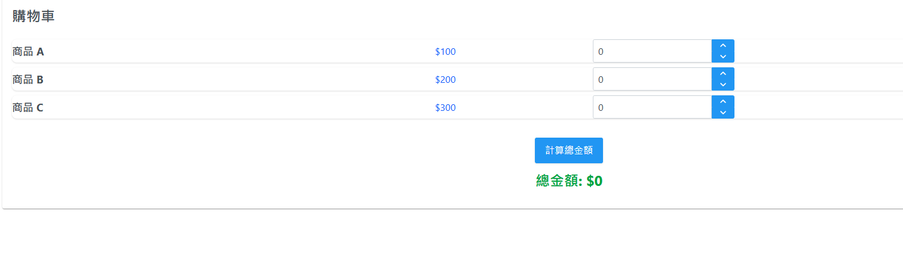
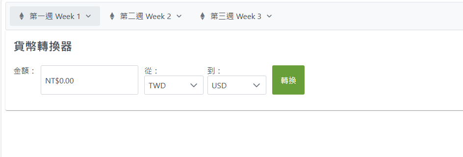
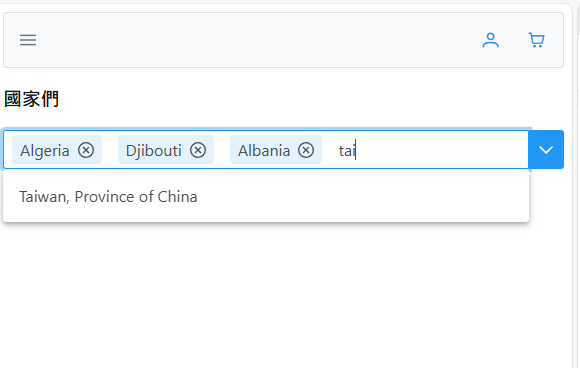

# 🧮 第三週：進階狀態管理與計算功能

Week 3: Advanced State Management and Calculation Functions

## 📚 課程概述 Course Overview

本週將深入探討 React 的進階狀態管理技巧，學習如何整合多個 useState，並實作複雜的計算功能。我們將從購物車的複雜狀態管理開始，學習如何整合多個 useState；接著實作計算機的計算邏輯與錯誤處理；然後學習資料轉換與格式化，最後使用 PrimeReact 的進階元件來建立專業的介面。

This week we will explore advanced state management techniques in React, learn how to integrate multiple useState, and implement complex calculation functions. We'll start with complex state management in shopping carts, learning how to integrate multiple useState; then implement calculator logic and error handling; followed by data transformation and formatting, and finally use PrimeReact's advanced components to create professional interfaces.

## 📑 章節 Chapters

1. 📝 購物車-複雜狀態管理（多個 useState 整合）
   Shopping Cart - Complex State Management (Multiple useState Integration)
2. 🧭 導覽列-使用 PrimeReact Menubar
   Navigation Bar - Using PrimeReact Menubar
3. ➕ 計算機-計算邏輯實作與錯誤處理
   Calculator - Calculation Logic Implementation and Error Handling
4. 🔄 貨幣轉換器-資料轉換與格式化
   Currency Converter - Data Transformation and Formatting
5. 🎯 使用 PrimeReact 進階元件
   Using PrimeReact Advanced Components

## 📝 課程內容 Course Content

### 1. 📝 購物車-複雜狀態管理（多個 useState 整合）

Complex State Management (Multiple useState Integration)

#### **多個狀態的整合 Multiple State Integration**

在實際應用中，我們經常需要管理多個相關的狀態。讓我們看看如何有效地整合這些狀態。

In real applications, we often need to manage multiple related states. Let's see how to effectively integrate these states.



```tsx
"use client";
import { useState } from "react";
import { InputNumber } from "primereact/inputnumber";
import { Button } from "primereact/button";
import { Card } from "primereact/card";

interface Product {
  id: number;
  name: string;
  price: number;
  quantity: number;
}

export default function ShoppingCart() {
  // 商品列表狀態
  const [products, setProducts] = useState<Product[]>([
    { id: 1, name: "商品 A", price: 100, quantity: 0 },
    { id: 2, name: "商品 B", price: 200, quantity: 0 },
    { id: 3, name: "商品 C", price: 300, quantity: 0 },
  ]);

  // 總金額狀態
  const [total, setTotal] = useState<number>(0);

  // 更新商品數量
  const updateQuantity = (id: number, quantity: number) => {

    setProducts(
      // 遍歷 products 陣列每一個商品 類似for迴圈
      products.map((product) =>
        // 如果商品 id 與要更新的 id 相同，則更新數量，否則保持原樣
        product.id === id ? { ...product, quantity } : product
      )
    );

  };

  // 計算總金額
  const calculateTotal = () => {
    let sum = 0; // 用來累加總金額
    for (const product of products) {
      sum += product.price * product.quantity;
    }
    setTotal(sum); // 設定總金額
  };

  return (
    <Card title="購物車" className="shadow-lg rounded-xl bg-slate-50">
      <div className="flex flex-col">
        {products.map((product) => (
          <div
            key={product.id}
            className="flex flex-row items-center rounded-lg shadow mb-2 bg-white gap-2"
          >
            <div className="font-bold text-lg w-[25vw]">{product.name}</div>
            <div className="text-blue-600 text-center w-[25vw]">${product.price}</div>
            <InputNumber
              value={product.quantity}
              onValueChange={(e) => updateQuantity(product.id, e.value || 0)}
              showButtons
              min={0}
              max={10}
              className="w-[5vw]"
            />
          </div>
        ))}
        <div className="flex flex-col items-center mt-6 gap-3">
          <Button label="計算總金額" onClick={calculateTotal} className="rounded-full px-8 py-3 text-lg bg-blue-500 hover:bg-blue-600 text-white font-semibold shadow" />
          <div className="text-2xl font-bold text-green-600">總金額: ${total}</div>
        </div>
      </div>
    </Card>
  );
}

```

### 2. 🧭 導覽列實作 Navigation Bar Implementation

使用 PrimeReact 的 Menubar 元件來建立一個專業的導覽列。

Using PrimeReact's Menubar component to create a professional navigation bar.

```tsx
"use client";
import { Menubar } from 'primereact/menubar';
import { MenuItem } from 'primereact/menuitem';
import { useRouter } from 'next/navigation';

export default function Navbar() {
    const router = useRouter();

    const items: MenuItem[] = [
        {
            label: '首頁',
            icon: 'pi pi-home',
            command: () => router.push('/')
        },
        {
            label: '購物車',
            icon: 'pi pi-shopping-cart',
            command: () => router.push('/cart')
        },
        {
            label: '計算機',
            icon: 'pi pi-calculator',
            command: () => router.push('/calculator')
        },
        {
            label: '貨幣轉換',
            icon: 'pi pi-dollar',
            command: () => router.push('/currency')
        }
    ];

    return (
        <div className="card">
            <Menubar model={items} className="border-none shadow-2" />
        </div>
    );
}
```

這個導覽列實作包含以下特點：

This navigation bar implementation includes the following features:

1. **使用 Menubar 元件**：提供專業的導覽列外觀和功能
   Using Menubar component: Provides professional navigation bar appearance and functionality
2. **整合路由功能**：使用 Next.js 的 `useRouter` 進行頁面導航
   Integrated routing: Uses Next.js's `useRouter` for page navigation
3. **圖示支援**：使用 PrimeIcons 為每個選項添加圖示
   Icon support: Uses PrimeIcons to add icons to each option
4. **響應式設計**：自動適應不同螢幕尺寸
   Responsive design: Automatically adapts to different screen sizes

要使用這個導覽列，需要：

To use this navigation bar, you need to:

1. 在 `app/layout.tsx` 中引入並使用
   Import and use in `app/layout.tsx`
2. 確保已安裝必要的依賴
   Ensure necessary dependencies are installed
3. 在 `globals.css` 中引入 PrimeReact 的樣式
   Import PrimeReact styles in `globals.css`

### 3. ➕ 計算機-計算邏輯實作與錯誤處理

Calculator - Calculation Logic Implementation and Error Handling

#### **基本計算功能 Basic Calculation Functions**

讓我們實作一個具有基本計算功能的計算機。

Let's implement a calculator with basic calculation functions.


```tsx
"use client";
import { useState } from "react";
import { InputNumber } from "primereact/inputnumber";
import { Dropdown } from "primereact/dropdown";
import { Button } from "primereact/button";
import { Card } from "primereact/card";
import { Message } from "primereact/message";

interface CalculatorState {
  firstNumber: number;
  secondNumber: number;
  operation: string;
  result: number;
  error: string;
}

export default function Calculator() {
  const [calculatorState, setCalculatorState] = useState<CalculatorState>({
    firstNumber: 0,
    secondNumber: 0,
    operation: "+",
    result: 0,
    error: "",
  });

  const operations = [
    { label: "+", value: "+" },
    { label: "-", value: "-" },
    { label: "×", value: "*" },
    { label: "÷", value: "/" },
  ];

  const handleCalculate = () => {
    try {
      let result = 0;
      switch (calculatorState.operation) {
        case "+":
          result = calculatorState.firstNumber + calculatorState.secondNumber;
          break;
        case "-":
          result = calculatorState.firstNumber - calculatorState.secondNumber;
          break;
        case "*":
          result = calculatorState.firstNumber * calculatorState.secondNumber;
          break;
        case "/":
          if (calculatorState.secondNumber === 0) {
            throw new Error("除數不能為零");
          }
          result = calculatorState.firstNumber / calculatorState.secondNumber;
          break;
      }
      setCalculatorState({ ...calculatorState, result, error: "" });
    } catch (error) {
      setCalculatorState({
        ...calculatorState,
        error: error instanceof Error ? error.message : "未知錯誤",
      });
    }
  };

  return (
    <Card title="基本計算機" className="w-25rem">
      <div className="flex flex-column gap-2">
        <div className="flex flex-column gap-2">
          <label htmlFor="firstNumber">第一個數字</label>
          <InputNumber
            id="firstNumber"
            value={calculatorState.firstNumber}
            onValueChange={(e) =>
              setCalculatorState({
                ...calculatorState,
                firstNumber: e.value || 0,
              })
            }
          />
        </div>

        <div className="flex flex-column gap-2">
          <label htmlFor="operation">運算符號</label>
          <Dropdown
            id="operation"
            value={calculatorState.operation}
            options={operations}
            onChange={(e) =>
              setCalculatorState({ ...calculatorState, operation: e.value })
            }
            placeholder="選擇運算符號"
          />
        </div>

        <div className="flex flex-column gap-2">
          <label htmlFor="secondNumber">第二個數字</label>
          <InputNumber
            id="secondNumber"
            value={calculatorState.secondNumber}
            onValueChange={(e) =>
              setCalculatorState({
                ...calculatorState,
                secondNumber: e.value || 0,
              })
            }
          />
        </div>

        <Button label="計算" onClick={handleCalculate} />

        {calculatorState.error ? (
          <Message severity="error" text={calculatorState.error} />
        ) : (
          <div className="text-xl font-bold">
            結果: {calculatorState.result}
          </div>
        )}
      </div>
    </Card>
  );
}

```

### 4. 🔄 貨幣轉換器-資料轉換與格式化

Currency Converter - Data Transformation and Formatting

#### **數字格式化 Number Formatting**

使用 PrimeReact 的 InputNumber 元件來實現數字格式化。

Use PrimeReact's InputNumber component to implement number formatting.



```tsx
"use client";
import { useState } from "react";
import { InputNumber } from "primereact/inputnumber";
import { Dropdown } from "primereact/dropdown";
import { Card } from "primereact/card";
import { Button } from "primereact/button";

interface Currency {
    code: string;
    symbol: string;
    rate: number; // 相對於台幣的匯率
}

export default function CurrencyConverter() {
    const currencies: Currency[] = [
        { code: "TWD", symbol: "NT$", rate: 1 },
        { code: "USD", symbol: "$", rate: 0.032 },
        { code: "JPY", symbol: "¥", rate: 4.8 },
        { code: "MYR", symbol: "RM", rate: 0.15 }
    ];

    const [amount, setAmount] = useState<number>(0);
    const [fromCurrency, setFromCurrency] = useState<Currency>(currencies[0]);
    const [toCurrency, setToCurrency] = useState<Currency>(currencies[1]);
    const [convertedAmount, setConvertedAmount] = useState<number>(0);

    const convertCurrency = () => {
        // 先轉換為台幣，再轉換為目標貨幣
        const amountInTWD = amount / fromCurrency.rate;
        const result = amountInTWD * toCurrency.rate;
        setConvertedAmount(result);
    };

    return (
        <Card title="貨幣轉換器" className="w-25rem">
            <div className="flex flex-column gap-3">
                <div className="flex flex-column gap-2">
                    <label>金額：</label>
                    <InputNumber
                        value={amount}
                        onValueChange={(e) => setAmount(e.value || 0)}
                        mode="currency"
                        currency={fromCurrency.code}
                        minFractionDigits={2}
                        maxFractionDigits={2}
                    />
                </div>

                <div className="flex gap-2">
                    <div className="flex-1">
                        <label>從：</label>
                        <Dropdown
                            value={fromCurrency}
                            options={currencies}
                            onChange={(e) => setFromCurrency(e.value)}
                            optionLabel="code"
                            className="w-full"
                        />
                    </div>
                    <div className="flex-1">
                        <label>到：</label>
                        <Dropdown
                            value={toCurrency}
                            options={currencies}
                            onChange={(e) => setToCurrency(e.value)}
                            optionLabel="code"
                            className="w-full"
                        />
                    </div>
                </div>

                <Button
                    onClick={convertCurrency}
                    severity="success"
                >
                    轉換
                </Button>

                {convertedAmount > 0 && (
                    <div className="text-xl font-bold p-3 border-1 border-round surface-200">
                        轉換結果：{toCurrency.symbol}{convertedAmount.toFixed(2)}
                    </div>
                )}
            </div>
        </Card>
    );
} 

```

### 5. 🎯 使用 PrimeReact 進階元件

Using PrimeReact Advanced Components

#### **AutoComplete 元件 AutoComplete Component**

AutoComplete 是一個輸入元件，可以在輸入時提供即時建議。它支援多種功能，包括基本搜尋、物件搜尋、分組選項等。

AutoComplete is an input component that provides real-time suggestions while being typed. It supports various features including basic search, object search, grouped options, and more.



```tsx
"use client";
import React, { useEffect, useState } from 'react';
import { AutoComplete, AutoCompleteCompleteEvent } from "primereact/autocomplete";

interface Country {
    name: string;
    code: string;
}

const getData = () => {
    return [
        { name: 'Afghanistan', code: 'AF' },
        { name: 'Albania', code: 'AL' },
        { name: 'Algeria', code: 'DZ' },
        { name: 'American Samoa', code: 'AS' },
        { name: 'Andorra', code: 'AD' },
        { name: 'Angola', code: 'AO' },
        { name: 'Anguilla', code: 'AI' },
        { name: 'Antarctica', code: 'AQ' },
        { name: 'Antigua and Barbuda', code: 'AG' },
        { name: 'Argentina', code: 'AR' },
        { name: 'Armenia', code: 'AM' },
        { name: 'Aruba', code: 'AW' },
        { name: 'Australia', code: 'AU' },
        { name: 'Austria', code: 'AT' },
        { name: 'Azerbaijan', code: 'AZ' },
        { name: 'Bahamas', code: 'BS' },
        { name: 'Bahrain', code: 'BH' },
        { name: 'Bangladesh', code: 'BD' },
        { name: 'Barbados', code: 'BB' },
        { name: 'Belarus', code: 'BY' },
        { name: 'Belgium', code: 'BE' },
        { name: 'Belize', code: 'BZ' },
        { name: 'Benin', code: 'BJ' },
        { name: 'Bermuda', code: 'BM' },
        { name: 'Bhutan', code: 'BT' },
        { name: 'Bolivia', code: 'BO' },
        { name: 'Bosnia and Herzegovina', code: 'BA' },
        { name: 'Botswana', code: 'BW' },
        { name: 'Bouvet Island', code: 'BV' },
        { name: 'Brazil', code: 'BR' },
        { name: 'British Indian Ocean Territory', code: 'IO' },
        { name: 'Brunei Darussalam', code: 'BN' },
        { name: 'Bulgaria', code: 'BG' },
        { name: 'Burkina Faso', code: 'BF' },
        { name: 'Burundi', code: 'BI' },
        { name: 'Cambodia', code: 'KH' },
        { name: 'Cameroon', code: 'CM' },
        { name: 'Canada', code: 'CA' },
        { name: 'Cape Verde', code: 'CV' },
        { name: 'Cayman Islands', code: 'KY' },
        { name: 'Central African Republic', code: 'CF' },
        { name: 'Chad', code: 'TD' },
        { name: 'Chile', code: 'CL' },
        { name: 'China', code: 'CN' },
        { name: 'Christmas Island', code: 'CX' },
        { name: 'Cocos (Keeling) Islands', code: 'CC' },
        { name: 'Colombia', code: 'CO' },
        { name: 'Comoros', code: 'KM' },
        { name: 'Congo', code: 'CG' },
        { name: 'Congo, The Democratic Republic of the', code: 'CD' },
        { name: 'Cook Islands', code: 'CK' },
        { name: 'Costa Rica', code: 'CR' },
        { name: 'Cote D"Ivoire', code: 'CI' },
        { name: 'Croatia', code: 'HR' },
        { name: 'Cuba', code: 'CU' },
        { name: 'Cyprus', code: 'CY' },
        { name: 'Czech Republic', code: 'CZ' },
        { name: 'Denmark', code: 'DK' },
        { name: 'Djibouti', code: 'DJ' },
        { name: 'Dominica', code: 'DM' },
        { name: 'Dominican Republic', code: 'DO' },
        { name: 'Ecuador', code: 'EC' },
        { name: 'Egypt', code: 'EG' },
        { name: 'El Salvador', code: 'SV' },
        { name: 'Equatorial Guinea', code: 'GQ' },
        { name: 'Eritrea', code: 'ER' },
        { name: 'Estonia', code: 'EE' },
        { name: 'Ethiopia', code: 'ET' },
        { name: 'Falkland Islands (Malvinas)', code: 'FK' },
        { name: 'Faroe Islands', code: 'FO' },
        { name: 'Fiji', code: 'FJ' },
        { name: 'Finland', code: 'FI' },
        { name: 'France', code: 'FR' },
        { name: 'French Guiana', code: 'GF' },
        { name: 'French Polynesia', code: 'PF' },
        { name: 'French Southern Territories', code: 'TF' },
        { name: 'Gabon', code: 'GA' },
        { name: 'Gambia', code: 'GM' },
        { name: 'Georgia', code: 'GE' },
        { name: 'Germany', code: 'DE' },
        { name: 'Ghana', code: 'GH' },
        { name: 'Gibraltar', code: 'GI' },
        { name: 'Greece', code: 'GR' },
        { name: 'Greenland', code: 'GL' },
        { name: 'Grenada', code: 'GD' },
        { name: 'Guadeloupe', code: 'GP' },
        { name: 'Guam', code: 'GU' },
        { name: 'Guatemala', code: 'GT' },
        { name: 'Guernsey', code: 'GG' },
        { name: 'Guinea', code: 'GN' },
        { name: 'Guinea-Bissau', code: 'GW' },
        { name: 'Guyana', code: 'GY' },
        { name: 'Haiti', code: 'HT' },
        { name: 'Heard Island and Mcdonald Islands', code: 'HM' },
        { name: 'Holy See (Vatican City State)', code: 'VA' },
        { name: 'Honduras', code: 'HN' },
        { name: 'Hong Kong', code: 'HK' },
        { name: 'Hungary', code: 'HU' },
        { name: 'Iceland', code: 'IS' },
        { name: 'India', code: 'IN' },
        { name: 'Indonesia', code: 'ID' },
        { name: 'Iran, Islamic Republic Of', code: 'IR' },
        { name: 'Iraq', code: 'IQ' },
        { name: 'Ireland', code: 'IE' },
        { name: 'Isle of Man', code: 'IM' },
        { name: 'Israel', code: 'IL' },
        { name: 'Italy', code: 'IT' },
        { name: 'Jamaica', code: 'JM' },
        { name: 'Japan', code: 'JP' },
        { name: 'Jersey', code: 'JE' },
        { name: 'Jordan', code: 'JO' },
        { name: 'Kazakhstan', code: 'KZ' },
        { name: 'Kenya', code: 'KE' },
        { name: 'Kiribati', code: 'KI' },
        { name: 'Korea, Democratic People"S Republic of', code: 'KP' },
        { name: 'Korea, Republic of', code: 'KR' },
        { name: 'Kuwait', code: 'KW' },
        { name: 'Kyrgyzstan', code: 'KG' },
        { name: 'Lao People"S Democratic Republic', code: 'LA' },
        { name: 'Latvia', code: 'LV' },
        { name: 'Lebanon', code: 'LB' },
        { name: 'Lesotho', code: 'LS' },
        { name: 'Liberia', code: 'LR' },
        { name: 'Libyan Arab Jamahiriya', code: 'LY' },
        { name: 'Liechtenstein', code: 'LI' },
        { name: 'Lithuania', code: 'LT' },
        { name: 'Luxembourg', code: 'LU' },
        { name: 'Macao', code: 'MO' },
        { name: 'Macedonia, The Former Yugoslav Republic of', code: 'MK' },
        { name: 'Madagascar', code: 'MG' },
        { name: 'Malawi', code: 'MW' },
        { name: 'Malaysia', code: 'MY' },
        { name: 'Maldives', code: 'MV' },
        { name: 'Mali', code: 'ML' },
        { name: 'Malta', code: 'MT' },
        { name: 'Marshall Islands', code: 'MH' },
        { name: 'Martinique', code: 'MQ' },
        { name: 'Mauritania', code: 'MR' },
        { name: 'Mauritius', code: 'MU' },
        { name: 'Mayotte', code: 'YT' },
        { name: 'Mexico', code: 'MX' },
        { name: 'Micronesia, Federated States of', code: 'FM' },
        { name: 'Moldova, Republic of', code: 'MD' },
        { name: 'Monaco', code: 'MC' },
        { name: 'Mongolia', code: 'MN' },
        { name: 'Montserrat', code: 'MS' },
        { name: 'Morocco', code: 'MA' },
        { name: 'Mozambique', code: 'MZ' },
        { name: 'Myanmar', code: 'MM' },
        { name: 'Namibia', code: 'NA' },
        { name: 'Nauru', code: 'NR' },
        { name: 'Nepal', code: 'NP' },
        { name: 'Netherlands', code: 'NL' },
        { name: 'Netherlands Antilles', code: 'AN' },
        { name: 'New Caledonia', code: 'NC' },
        { name: 'New Zealand', code: 'NZ' },
        { name: 'Nicaragua', code: 'NI' },
        { name: 'Niger', code: 'NE' },
        { name: 'Nigeria', code: 'NG' },
        { name: 'Niue', code: 'NU' },
        { name: 'Norfolk Island', code: 'NF' },
        { name: 'Northern Mariana Islands', code: 'MP' },
        { name: 'Norway', code: 'NO' },
        { name: 'Oman', code: 'OM' },
        { name: 'Pakistan', code: 'PK' },
        { name: 'Palau', code: 'PW' },
        { name: 'Palestinian Territory, Occupied', code: 'PS' },
        { name: 'Panama', code: 'PA' },
        { name: 'Papua New Guinea', code: 'PG' },
        { name: 'Paraguay', code: 'PY' },
        { name: 'Peru', code: 'PE' },
        { name: 'Philippines', code: 'PH' },
        { name: 'Pitcairn', code: 'PN' },
        { name: 'Poland', code: 'PL' },
        { name: 'Portugal', code: 'PT' },
        { name: 'Puerto Rico', code: 'PR' },
        { name: 'Qatar', code: 'QA' },
        { name: 'Reunion', code: 'RE' },
        { name: 'Romania', code: 'RO' },
        { name: 'Russian Federation', code: 'RU' },
        { name: 'RWANDA', code: 'RW' },
        { name: 'Saint Helena', code: 'SH' },
        { name: 'Saint Kitts and Nevis', code: 'KN' },
        { name: 'Saint Lucia', code: 'LC' },
        { name: 'Saint Pierre and Miquelon', code: 'PM' },
        { name: 'Saint Vincent and the Grenadines', code: 'VC' },
        { name: 'Samoa', code: 'WS' },
        { name: 'San Marino', code: 'SM' },
        { name: 'Sao Tome and Principe', code: 'ST' },
        { name: 'Saudi Arabia', code: 'SA' },
        { name: 'Senegal', code: 'SN' },
        { name: 'Serbia and Montenegro', code: 'CS' },
        { name: 'Seychelles', code: 'SC' },
        { name: 'Sierra Leone', code: 'SL' },
        { name: 'Singapore', code: 'SG' },
        { name: 'Slovakia', code: 'SK' },
        { name: 'Slovenia', code: 'SI' },
        { name: 'Solomon Islands', code: 'SB' },
        { name: 'Somalia', code: 'SO' },
        { name: 'South Africa', code: 'ZA' },
        { name: 'South Georgia and the South Sandwich Islands', code: 'GS' },
        { name: 'Spain', code: 'ES' },
        { name: 'Sri Lanka', code: 'LK' },
        { name: 'Sudan', code: 'SD' },
        { name: 'Suriname', code: 'SR' },
        { name: 'Svalbard and Jan Mayen', code: 'SJ' },
        { name: 'Swaziland', code: 'SZ' },
        { name: 'Sweden', code: 'SE' },
        { name: 'Switzerland', code: 'CH' },
        { name: 'Syrian Arab Republic', code: 'SY' },
        { name: 'Taiwan, Province of China', code: 'TW' },
        { name: 'Tajikistan', code: 'TJ' },
        { name: 'Tanzania, United Republic of', code: 'TZ' },
        { name: 'Thailand', code: 'TH' },
        { name: 'Timor-Leste', code: 'TL' },
        { name: 'Togo', code: 'TG' },
        { name: 'Tokelau', code: 'TK' },
        { name: 'Tonga', code: 'TO' },
        { name: 'Trinidad and Tobago', code: 'TT' },
        { name: 'Tunisia', code: 'TN' },
        { name: 'Turkey', code: 'TR' },
        { name: 'Turkmenistan', code: 'TM' },
        { name: 'Turks and Caicos Islands', code: 'TC' },
        { name: 'Tuvalu', code: 'TV' },
        { name: 'Uganda', code: 'UG' },
        { name: 'Ukraine', code: 'UA' },
        { name: 'United Arab Emirates', code: 'AE' },
        { name: 'United Kingdom', code: 'GB' },
        { name: 'United States', code: 'US' },
        { name: 'United States Minor Outlying Islands', code: 'UM' },
        { name: 'Uruguay', code: 'UY' },
        { name: 'Uzbekistan', code: 'UZ' },
        { name: 'Vanuatu', code: 'VU' },
        { name: 'Venezuela', code: 'VE' },
        { name: 'Viet Nam', code: 'VN' },
        { name: 'Virgin Islands, British', code: 'VG' },
        { name: 'Virgin Islands, U.S.', code: 'VI' },
        { name: 'Wallis and Futuna', code: 'WF' },
        { name: 'Western Sahara', code: 'EH' },
        { name: 'Yemen', code: 'YE' },
        { name: 'Zambia', code: 'ZM' },
        { name: 'Zimbabwe', code: 'ZW' }
    ];
}


export default function MultipleDemo() {
    const [countries, setCountries] = useState<Country[]>([]);
    const [selectedCountries, setSelectedCountries] = useState<Country | null>(null);
    const [filteredCountries, setFilteredCountries] = useState<Country[]>([]);

    // 搜尋 依照輸入內容 過濾
    const search = (event: AutoCompleteCompleteEvent) => {
        let _filteredCountries;
  
        if (!event.query.trim().length) {
            // 如果輸入內容為空 則顯示所有國家
            _filteredCountries = [...countries];
        }
        else {
            // 如果輸入內容不為空 則過濾出符合的國家
            _filteredCountries = countries.filter((country) => {
                return country.name.toLowerCase().startsWith(event.query.toLowerCase());
            });
        }

        setFilteredCountries(_filteredCountries);
    }

    useEffect(() => {
        setCountries(getData());
    }, []);

    return (
        <div className="card p-fluid">
            <h3>國家們</h3>
            <AutoComplete
                dropdown
                field="name"
                multiple
                value={selectedCountries}
                suggestions={filteredCountries}
                completeMethod={search}
                onChange={(e) => setSelectedCountries(e.value)}
            />
        </div>
    )
}

```

這個範例展示了 AutoComplete 元件的幾個重要功能：

This example demonstrates several important features of the AutoComplete component:

1. **基本搜尋功能**：使用者輸入時會即時過濾並顯示符合的選項。
   Basic search functionality: Filters and displays matching options in real-time as the user types.
2. **物件搜尋**：使用 `field` 屬性指定要顯示的物件屬性。
   Object search: Uses the `field` property to specify which object property to display.
3. **自訂模板**：使用 `itemTemplate` 自訂每個選項的顯示方式。
   Custom template: Uses `itemTemplate` to customize how each option is displayed.
4. **多選功能**：使用 `multiple` 屬性啟用多選功能。
   Multiple selection: Uses the `multiple` property to enable multiple selection.
5. **即時過濾**：使用 `completeMethod` 實作即時搜尋邏輯。
   Real-time filtering: Uses `completeMethod` to implement real-time search logic.

## 🎯 課程重點

Course Highlights

1. **複雜狀態管理** 📝

   - 多個 useState 的整合
   - 狀態之間的關聯性
   - 狀態更新的實踐
2. **計算邏輯** ➕

   - 基本運算功能實作
   - 錯誤處理機制
3. **資料格式化** 🔄

   - 數字格式化
   - 貨幣顯示
4. **進階元件應用** 🎨

   - AutoComplete 的使用
   - 元件樣式客製化
   - 事件處理整合

## 📝 課程總結

Course Summary

本週我們深入學習了 React 的進階狀態管理技巧，實作了複雜的計算功能，並學習了如何使用 PrimeReact 的進階元件。通過實作計算機應用，我們掌握了如何整合多個狀態、處理錯誤情況，以及格式化資料。這些技能將幫助我們在後續課程中建立更複雜的應用程式。

This week we delved into advanced state management techniques in React, implemented complex calculation functions, and learned how to use PrimeReact's advanced components. Through implementing a calculator application, we mastered how to integrate multiple states, handle error cases, and format data. These skills will help us build more complex applications in subsequent courses.

## 🔜 下週預告

Next Week Preview

下週我們將學習資料處理與動態渲染，包括資料結構設計、動態列表渲染，以及使用 PrimeReact 的資料展示元件。

Next week, we will learn about data processing and dynamic rendering, including data structure design, dynamic list rendering, and using PrimeReact's data display components.

## 📝 課後練習：整合導覽列與各功能頁面

### 練習目標

建立一個整合所有功能的完整應用程式，包含以下功能：

1. 🧭 導覽列實作
2. 🔐 登入/註冊功能
   - 整合第二週的登入頁面
   - 整合第二週的註冊頁面
3. 🛒 購物車功能
4. 🧮 計算機功能
5. 💱 貨幣轉換功能

### 提示

```tsx
// 路由設定示例
const items: MenuItem[] = [
    {
        label: '首頁',
        icon: 'pi pi-home',
        command: () => router.push('/')
    },
    {
        label: '登入',
        icon: 'pi pi-sign-in',
        command: () => router.push('/login')
    },
    {
        label: '註冊',
        icon: 'pi pi-user-plus',
        command: () => router.push('/register')
    },
    {
        label: '購物車',
        icon: 'pi pi-shopping-cart',
        command: () => router.push('/cart')
    },
];
```

### 進階挑戰

1. 🔐 身份驗證

   - 實作登入狀態管理
   - 未登入用戶限制訪問某些頁面
   - 實作登出功能
2. 🎨 UI/UX 優化

   - 添加載入動畫
   - 實作響應式設計
   - 優化表單驗證提示
3. 📱 行動裝置支援

   - 優化行動裝置顯示
   - 實作行動裝置選單
   - 調整元件大小與間距
4. 🔄 狀態管理

   - 使用 Context API 管理全域狀態
   - 實作購物車資料持久化
   - 優化狀態更新邏輯

## 📝 延伸閱讀

1. 頁面驗證登入狀態的機制
2. React Context API是什麼
3. 響應式設計的實作技巧 Tailwind CSS 的響應式設計
4. 試著做出自己喜歡的 css Class 讓每次使用元件時 可以直接套用
5. 嘗試著將過去的功能做成Component  讓Page.tsx引用 讓同樣的元件可以重複使用
