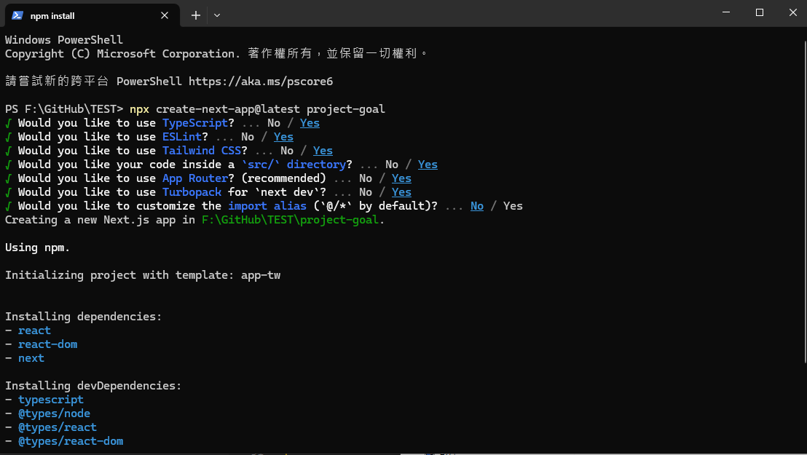
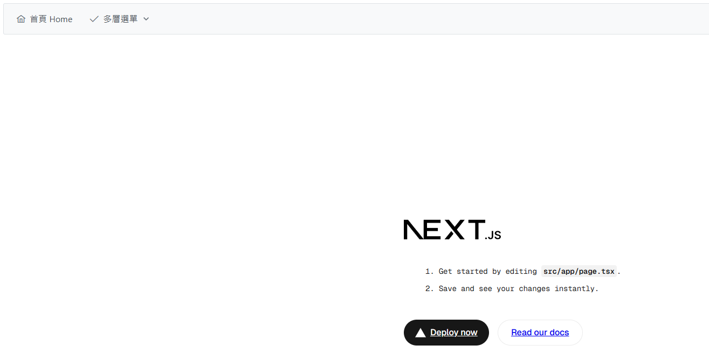

# 🧮 第四週：結束新手村-開始實作！

## 📚 課程概述 Course Overview
從這週開始，我們將會開始進行實作，從建立一個新的專案、初始化設定、建立導覽列、串接導航列頁面、實作各項功能。

## 📑 章節 Chapters

## 📝 課程內容 Course Content

### 1. 🚀 開新專案

#### 📌 建立專案
請先建立一個新的專案

```bash
npx create-next-app@latest project-goal
```


#### 📦 安裝依賴
進入資料夾並安裝 PrimeReact Icons

```bash
cd project-goal
npm install primereact primeicons
```

#### 🎨 修改CSS設定

##### 1️⃣ 引入 PrimeReact CSS
在 `src\app\layout.tsx` 貼上 CSS
```tsx
import "primereact/resources/themes/saga-blue/theme.css";
import "primereact/resources/primereact.min.css";
import "primeicons/primeicons.css";
```

##### 2️⃣ 修改 globals.css
```css
/* @import "tailwindcss"; */

@layer theme, base, components, utilities;
@import "tailwindcss/theme.css" layer(theme);
@import "tailwindcss/utilities.css" layer(utilities);
```

#### 🧩 建立導覽列

##### 1️⃣ 建立必要資料夾
在 `src\` 資料夾中建立 `components` 資料夾
在 `src\components` 中建立 `NavBar.tsx` 檔案

##### 2️⃣ 實作導覽列元件
```tsx
"use client";
import { Menubar } from "primereact/menubar";
import { Button } from "primereact/button";
import { useRouter } from "next/navigation";

export default function NavBar() {
    const router = useRouter();
    const items = [
        {
            label: "首頁 Home",
            icon: "pi pi-home",
            command: () => router.push("/"),
        },
        {
            label: "多層選單",
            icon: "pi pi-check",
            items: [
                {
                    label: "頁面一",
                    icon: "pi pi-plus",
                    command: () => router.push("/page1"),
                },
                {
                    label: "頁面二",
                    icon: "pi pi-plus",
                    command: () => router.push("/page2"),
                },
            ],
        },
    ];
    const end = (
        <div className="flex align-items-center gap-2">
            <Button icon="pi pi-user" rounded text />
        </div>
    );

    return (
        <div className="card">
            <Menubar model={items} end={end} />
        </div>
    );
}
```

##### 3️⃣ 整合導覽列
在 `src\app\layout.tsx` 中引入 NavBar，並在 `{children}` 之前加入 `<NavBar />` 元件
```tsx
import NavBar from "@/components/NavBar";

<>
    <NavBar />
    {children}
</>
```

#### 🚀 啟動專案
使用 `npm run dev` 啟動專案並進行驗證成果



